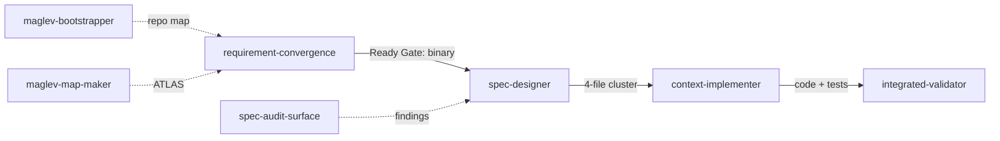
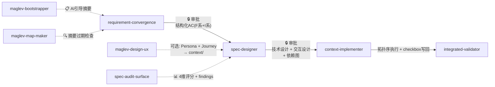
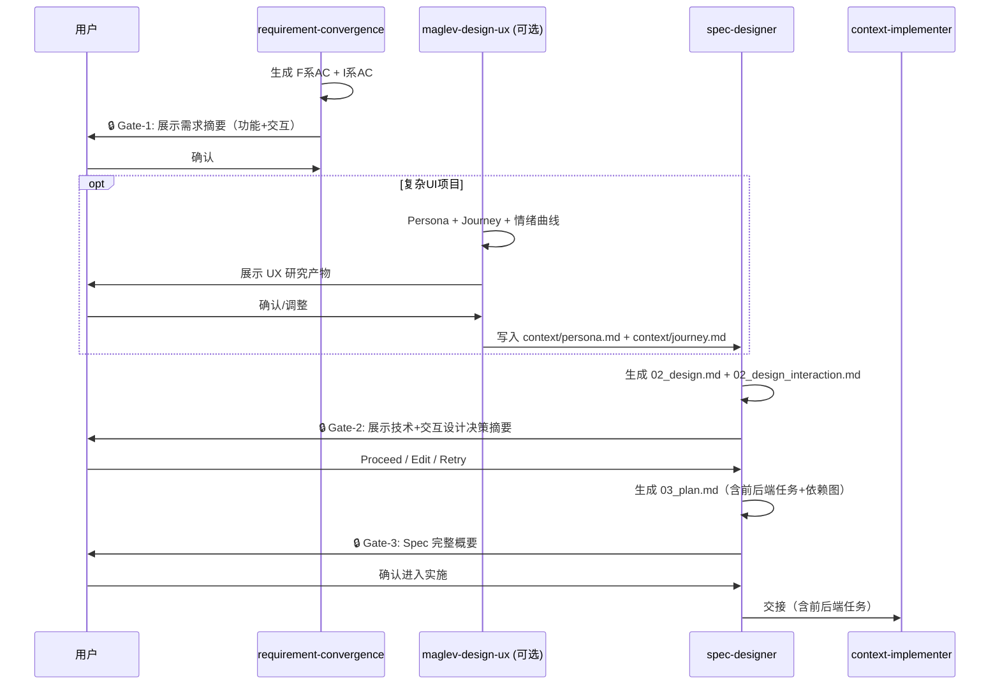
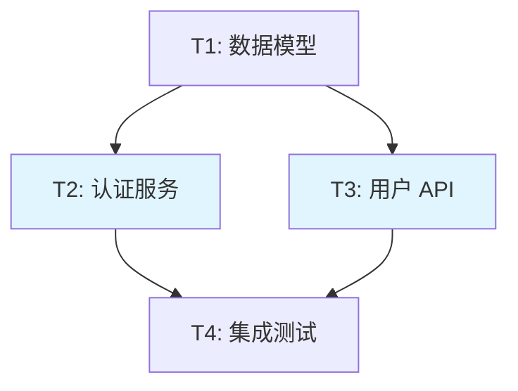
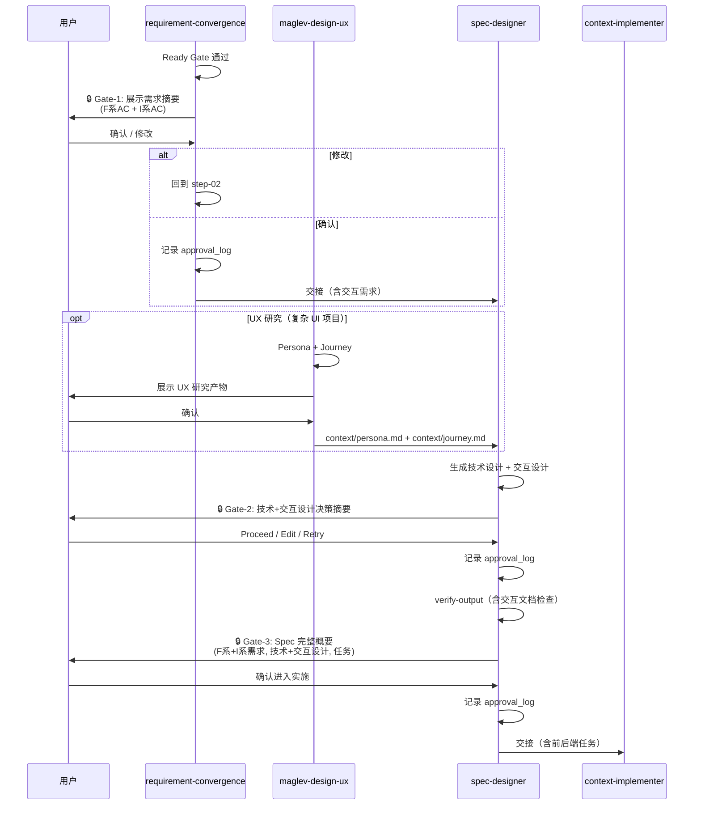
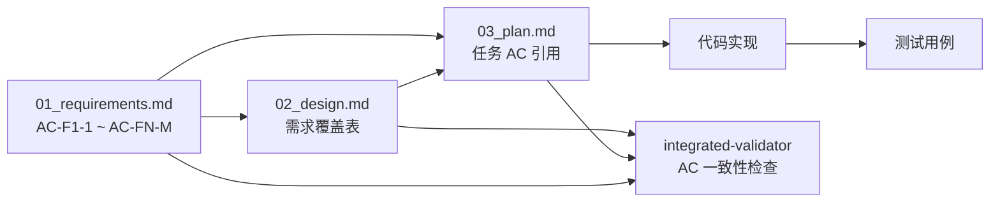

# 主流程质量门禁 — 设计文档

## Overview

本方案对 Maglev 主流程（requirement-convergence → spec-designer → context-implementer）及其审计层（spec-audit-surface / integrated-validator / review-validation-surface / test-design-surface）和基础设施层（maglev-bootstrapper / maglev-map-maker）做 7 项增强。改动方式为修改现有 step/template 文件的指令内容，不引入新 skill 或新路由逻辑。

实施策略：P0（F-1/F-2/F-3）先行，P1（F-4/F-5/F-7）跟进，P2（F-6）独立推进。所有改动向后兼容——简单任务走现有路径不受影响。

## 需求覆盖

| 需求 | AC | 设计覆盖位置 |
|------|-----|-------------|
| F-1 审批门禁 | AC-F1-1 ~ F1-5 | §变更方案 F-1, §数据流 |
| F-2 结构化需求 | AC-F2-1 ~ F2-5 | §变更方案 F-2 |
| F-3 AC 追溯 | AC-F3-1 ~ F3-5 | §变更方案 F-3 |
| F-4 任务依赖图 | AC-F4-1 ~ F4-4 | §变更方案 F-4 |
| F-5 审计评分 | AC-F5-1 ~ F5-4 | §变更方案 F-5 |
| F-6 AI 引导 | AC-F6-1 ~ F6-3 | §变更方案 F-6 |
| F-7 验证层前端能力 | AC-F7-1 ~ F7-4 | §变更方案 F-7 |

## 架构

### 当前主流程



### 增强后主流程



新增元素用 🔒（门禁）📊（评分）📋（引导）🔍（检查）标记。虚线为可选路径。

### 含 UI 项目的完整审批链



## 组件职责

| 组件 | 现有职责 | 新增/修改职责 | 覆盖 AC |
|------|---------|-------------|---------|
| requirement-convergence step-04-handoff | 将 Ready Gate 结果交接给下游 | + 展示产物摘要（含 F 系和 I 系 AC）+ 等待用户审批 + 记录审批结果 | AC-F1-1, F1-2, F1-5 |
| requirement-convergence step-02-define | 定义核心对象、边界、成功信号 | + 生成结构化 AC（F 系功能 + I 系交互）+ 自动生成初版 | AC-F2-1, F2-2, F2-3, F2-5 |
| requirement-convergence prd-output-contract | 定义 prd_output_package 字段 | + 新增 functional_requirements 字段 | AC-F2-1, F2-4 |
| spec-designer wrapper-02-draft | 生成 draft 并请求用户确认 | + 展示技术+交互设计决策摘要 + 明确"设计方向确认" | AC-F1-3 |
| spec-designer step-04-verify-output | 检查文件存在性 | + 检查交互文档（含 UI 项目时）+ 展示完整概要 + "是否进入实施" | AC-F1-4, F1-5 |
| spec-designer tech-spec-template | 02_design.md 模板 | + 需求覆盖表 + 组件「覆盖AC」列 + 设计决策表 | AC-F3-1, F3-2, F3-5 |
| spec-designer tech-spec-template §03 | 03_plan.md 格式 | + 结构化任务区段 + Mermaid 依赖图 + AC 引用 | AC-F3-3, F4-1, F4-2 |
| context-implementer step-02-context | 加载上下文和任务列表 | + 解析依赖图 + 拓扑排序 | AC-F4-3 |
| context-implementer step-03-execute | 串行执行任务 | + 按拓扑序执行 + checkbox 写回 | AC-F4-3, F4-4 |
| spec-audit-surface step-04-synthesize | 汇总 findings | + 4 维评分输出 + 写入 context | AC-F5-1 ~ F5-4 |
| integrated-validator | 5 层健康度评分 | + 检查 AC 引用一致性（编号存在性）+ Layer 3 前端实质性验证 | AC-F3-4, F7-1 |
| spec-audit-surface step-04 | 汇总 findings | + 4 维评分输出 + 交互 spec 审计维度 | AC-F5-1 ~ F5-4, F7-2 |
| review-validation-surface | 实现合规检查 | + 前端质量维度（状态管理/可访问性/响应式） | AC-F7-3 |
| test-design-surface | 测试策略设计 | + 前端特有测试层（组件交互/状态转换/a11y） | AC-F7-4 |
| maglev-bootstrapper | 初始化仓库骨架 | + 生成 AI 引导摘要 + 用户确认 | AC-F6-1, F6-2 |
| maglev-map-maker | 生成 ATLAS.md | + 检查 AI 引导摘要过期 + 提醒更新 | AC-F6-3 |

---

## 变更方案

### F-1: 阶段交接强制审批

**设计原则**：审批门禁是产物无关的机制——不绑定具体文档数量，而是审批"当前阶段产出的所有产物"。当项目含 UI 时，产物集自然扩展到交互需求和交互设计。

**改动 1: requirement-convergence / step-04-handoff.md**

在 Ready Gate 通过后、交接前插入审批指令：

```markdown
## 审批检查点（新增）

当 Ready Gate 判定为 ready 时，在交接前执行以下步骤：

1. **展示产物摘要**：向用户展示以下内容的精简版：
   - 核心对象（core_object）
   - InScope / OutScope
   - 功能需求关键 AC（F 系前 3 条）
   - 如果存在交互需求：交互需求关键 AC（I 系前 3 条）

2. **等待明确确认**：
   - 询问："以上需求边界是否准确？确认后将进入方案设计。"
   - 只接受明确肯定信号（"确认"/"是"/"approved"等）
   - 不可将模糊回复（"差不多吧"/"看看再说"）解读为确认

3. **处理修改请求**：
   - 若用户提出修改，回到 step-02 补齐，重新走 Ready Gate
   - 不强制继续交接

4. **记录审批**：
   - 在 spec context 中追加审批记录：
     ```yaml
     approval_log:
       - checkpoint: requirement_handoff
         result: approved | rejected
         artifacts_reviewed:
           - 01_requirements_functional.md
           - 01_requirements_interaction.md  # 仅含 UI 项目
         summary: "{用户确认的内容摘要}"
         timestamp: "{ISO 8601}"
     ```
```

**改动 2: spec-designer / wrapper-02-draft.md**

现有 wrapper-02 已有 Proceed|Edit|Retry 机制。增强为：

```markdown
## 设计方向确认（修改现有 Proceed 逻辑）

在展示 draft 时，展示所有设计文档的关键决策：

**技术设计决策**（从 02_design.md 的设计决策表提取）：
- 每个决策的选择理由（一句话）

**交互设计决策**（如果存在 02_design_interaction.md）：
- UI 架构选择（如"单页 tab 切换 vs 多页面"）
- 关键状态流转概要
- 响应式策略概要

询问："以上设计方向是否正确？（含技术设计和交互设计）"
- Proceed → 继续到 wrapper-03
- Edit → 用户修改后重新生成
- Retry → 完全重新生成

记录到 approval_log（同上格式，checkpoint: design_draft，
artifacts_reviewed 列出所有设计文档）。
```

**改动 3: spec-designer / step-04-verify-output.md**

现有检查为 4 文件存在性。增加最终审批：

```markdown
## 产物完整性检查（修改现有逻辑）

必须存在：
- 00_index.md
- 01_requirements.md（或 01_requirements_functional.md）
- 02_design.md
- 03_plan.md

可选（含 UI 项目时应存在）：
- 01_requirements_interaction.md
- 02_design_interaction.md

## 进入实施审批（新增，在结构检查通过后）

1. 展示 spec 产出概要：
   - 需求数量：F 系 {N} 个 + I 系 {M} 个（如有）
   - AC 总数
   - 设计文档数量（技术 + 交互）
   - 任务数量 + 预估复杂度

2. 询问："Spec 已通过结构检查，是否可以进入实施？"

3. 记录到 approval_log（checkpoint: spec_final，
   artifacts_reviewed 列出所有产出文件）。
```

**改动 4: maglev-design-ux 与审批流的衔接**

当用户在 spec-designer 之前启用 maglev-design-ux 时：

```markdown
## UX 研究产物审批（在 UX skill 的 step-04-handoff 中）

maglev-design-ux 产出 Persona + Journey 后：
1. 展示给用户确认（现有机制保留）
2. 确认后写入 context/persona.md 和 context/journey.md
3. spec-designer 的 wrapper-01 在加载上下文时自动读取这些文件
4. 如果 context/ 中存在 UX 产物，spec-designer 必须在生成
   02_design_interaction.md 时参考这些产物

注意：UX 步骤是可选的。不启用 UX 时，spec-designer 仍可
独立生成交互设计（基于 I 系需求），只是缺少用户研究输入。
```

---

### F-2: 结构化行为级需求格式

**改动 1: requirement-convergence / prd-output-contract.md**

在现有 10 字段的 prd_output_package 基础上，新增可选字段：

```yaml
# prd_output_package 新增字段
functional_requirements:     # 可选。简单任务为空
  - id: "F-1"
    name: "{功能名称}"
    user_story: "作为 {角色}，我希望 {功能}，以便 {价值}"
    acceptance_criteria:
      - id: "AC-F1-1"
        criterion: "当 {触发条件} 时，系统应 {响应行为}"
      - id: "AC-F1-2"
        criterion: "若 {前置条件}，则系统应 {响应行为}"
    boundary_cases:          # 可选
      - "{边界情况描述}"
```

**改动 2: requirement-convergence / step-02-define.md**

在核心对象和边界定义后，增加 AC 生成指令：

```markdown
## 结构化验收标准生成（新增）

当任务复杂度需要结构化需求时（非简单修复/独立改动）：

1. 根据 in_scope 和用户描述，自动生成功能需求初版：
   - 每个功能需求包含：用户故事 + 至少 1 条 AC
   - AC 格式："当 [触发条件] 时，系统应 [响应行为]" 或 "若 [前置条件]，则系统应 [响应行为]"
   - AC 编号：AC-F{N}-{M}（F=功能需求序号，M=AC序号）
   - 不允许"支持 X 功能"式的模糊描述

2. 展示给用户审核：
   - 一次性展示全部初版 AC
   - 用户可增删改
   - 不逐条追问

3. 如果用户描述过于模糊：
   - 追问"这个功能在什么条件下触发？预期什么响应？"
   - 获得澄清后再生成

判断"是否需要结构化需求"的依据：
- 有跨角色协作需求 → 需要
- 需要行为级验收标准 → 需要
- in_scope 一句话描述完 → 不需要
```

---

### F-3: AC 编号下游引用与设计文档规范化

**改动 1: spec-designer / tech-spec-template.md**

将现有设计模板替换为标准化结构。必须小节：

1. **Overview** — 一段话概述
2. **需求覆盖表** — AC → 设计位置映射
3. **架构图** — Mermaid graph
4. **组件职责表** — 含「覆盖 AC」列
5. **设计决策表** — 决策 + 理由 + 备选 + 关联 AC

推荐小节（按项目类型选填）：
- 数据流图（sequenceDiagram）
- 接口定义
- 数据模型
- 错误处理策略
- 测试策略

模板详见：`context/design_template_preview.md`

**改动 2: spec-designer / wrapper-03-plan.md（或 plan 生成相关模板）**

在 03_plan.md 的任务列表中增加 AC 引用：

```markdown
## 实施任务

- [ ] T1: {任务描述} → _需求: AC-F1-1, AC-F2-3_
  - {子步骤}
  - {子步骤}
```

每个任务必须标注覆盖的 AC 编号。

**改动 3: integrated-validator**

在现有 5 层验证的 Layer 4（Spec ↔ Tests）基础上增加：

```markdown
## AC 引用一致性检查（新增）

扫描所有下游文档（02_design.md、03_plan.md）中引用的 AC 编号：
- 检查每个引用的 AC-F{N}-{M} 在源需求文档中是否存在
- 不存在的标记为 CRITICAL: "AC-F2-5 在设计中被引用但需求中不存在"
- 检查需求中的每个 AC 是否在设计的需求覆盖表中至少出现一次
- 未覆盖的标记为 WARNING: "AC-F3-2 未被任何设计节引用"
```

---

### F-4: 任务依赖图与执行编排

**改动 1: spec-designer 03_plan.md 模板**

在现有 plan 内容后增加两个必须区段：

```markdown
## 实施任务

- [ ] T1: 定义数据模型接口 → _需求: AC-F1-1, AC-F2-1_
  - 创建 TypeScript 接口
  - 添加验证函数

- [ ] T2: 实现认证服务 → _需求: AC-F1-2, AC-F1-3_
  - JWT 签发与验证
  - 密码锁定逻辑

- [ ] T3: 实现用户 API → _需求: AC-F2-2_
  - RESTful 路由
  - 权限中间件

- [ ] T4: 编写集成测试 → _需求: AC-F1-1~3, AC-F2-1~2_

## 任务依赖



T2 和 T3 可并行执行（无互相依赖）。蓝色节点为可并行任务。
```

规则：
- ≤3 个任务时可用扁平列表，不要求依赖图
- 最多 2 层层级
- 只包含编码任务（排除部署、环境搭建）

**改动 2: context-implementer / step-02-context.md**

在加载 spec 上下文时增加依赖图解析：

```markdown
## 依赖图解析（新增）

如果 03_plan.md 包含「任务依赖」区段：
1. 解析 Mermaid flowchart，提取任务节点和依赖边
2. 按拓扑排序确定执行顺序
3. 标记可并行任务组（入度相同、无互相依赖的任务集合）
4. 将排序后的执行序列传递给 step-03

如果 03_plan.md 不包含依赖图：
保持当前行为——按列表顺序串行执行。
```

**改动 3: context-implementer / step-03-execute.md**

修改执行逻辑：

```markdown
## 执行顺序（修改）

当有依赖图排序结果时：
- 按拓扑排序确定的顺序执行
- 可并行任务根据复杂度决定是否批量执行（当前建议：仍串行，但按正确顺序）
- 完成每个任务后，将对应 checkbox 标记为 [x]
- 只改 checkbox 状态，不改任务描述、不删任务、不改依赖图

当无依赖图时：
- 保持当前行为（按列表顺序串行执行）
```

---

### F-5: 审计评分量化

**改动 1: spec-audit-surface / step-04-synthesize.md（或最终输出步骤）**

在现有 findings 汇总后增加评分输出：

```markdown
## 质量评分（新增）

对审计发现按 4 个维度打分，各 25 分：

| 维度 | 检查内容 | 评分依据 |
|------|---------|---------|
| 完整性 | 需求是否全覆盖、设计是否处理了所有需求 | Critical finding 每个 -10，Warning -5 |
| 清晰度 | 表达是否无歧义、结构是否易消费 | 悬空引用 -10，格式不一致 -5 |
| 可行性 | 技术选型是否匹配、约束是否合理 | 不可行的技术选型 -15，风险未缓解 -5 |
| 一致性 | 需求↔设计↔计划是否对齐、AC 引用是否正确 | 断裂 AC 每个 -10，不存在的引用 -15 |

综合分 = 算术平均，同时高亮最低维度。

输出格式：

| 维度 | 得分 | 关键发现 |
|------|------|---------|
| 完整性 | {N}/100 | {最关键的 finding} |
| 清晰度 | {N}/100 | {或 "—"} |
| 可行性 | {N}/100 | |
| 一致性 | {N}/100 | |
| **综合** | **{N}/100** | {🟢≥85 / 🟡70-84 / 🔴<70} ⚠️ 最低维度: {name} {score} |

写入位置：`context/audit_score.md`，按阶段覆盖最新结果。
```

注意：
- 未生成结构化 AC 的简单任务，一致性维度标为 N/A
- 评分是参考信号，不是硬门禁——硬门禁是 F-1 的人工审批
- integrated-validator 已有健康度评分（0-100%），保持不变。本评分用于 spec-audit-surface 的单文档质量评估

---

### F-6: 项目级 AI 引导增强

**改动 1: repository_map.md 模板**

在 maglev-bootstrapper 生成的 repository_map.md 中，每个仓库条目下增加 AI 引导摘要模板：

```markdown
## {仓库名} — AI 引导摘要

> 生成日期: {YYYY-MM-DD} | 生成方式: maglev-bootstrapper 自动扫描 + 用户确认

### 产品上下文
- 目标用户: {谁在用}
- 核心功能: {做什么}
- 业务规则: {关键约束}

### 技术约定
- 技术栈: {框架 + 语言 + 工具链}
- 构建: `{build command}` | 测试: `{test command}` | 开发: `{dev command}`
- 规范: {lint + format 规则}

### 代码结构
- `{dir1}/` — {职责}
- `{dir2}/` — {职责}
- `{dir3}/` — {职责}
```

每个仓库摘要控制在 20 行以内。

**改动 2: maglev-bootstrapper**

在仓库注册流程（Phase 2: Inject）中增加：

```markdown
## AI 引导摘要生成（新增）

注册新仓库后：
1. 扫描项目文件生成摘要：
   - 产品上下文: README.md 前 3 段 + package.json description
   - 技术约定: package.json dependencies + tsconfig + .eslintrc + Makefile
   - 代码结构: src/ 或 lib/ 目录（2 层深度）
2. 展示给用户确认（不直接写入）
3. 用户确认后追加到 repository_map.md
```

**改动 3: maglev-map-maker**

在地图更新流程中增加过期检查：

```markdown
## AI 引导摘要过期检查（新增）

执行地图更新时，对每个仓库：
1. 对比当前 package.json dependencies 与摘要中记录的技术栈
2. 对比当前 src/ 结构与摘要中记录的代码结构
3. 如果检测到显著变化（核心依赖版本大变、新增/删除主要目录）：
   - 标记为"摘要可能过期"
   - 提醒用户："{仓库} 的 AI 引导摘要可能过期，是否重新生成？"
4. 用户确认后重新扫描生成
```

---

### F-7: 验证层前端/交互能力补齐

**现状诊断**：4 个验证层技能（integrated-validator、spec-audit-surface、review-validation-surface、test-design-surface）声称覆盖前端但实际验证逻辑全为后端视角。前端维度仅停留在文件存在性检查级别。

**设计原则**：不创建独立的"前端验证 skill"——在现有 4 个技能的步骤文件中补充前端特定的检查指令，与后端检查并列。

**改动 1: integrated-validator — Layer 3 前端实质性验证**

当前 Layer 3 只检查 "UI 组件/Store 是否存在"（文件级）。增强为：

```markdown
## Layer 3: Spec ↔ Code (Frontend) — 增强版

### 组件一致性检查
- 交互设计文档（02_design_interaction.md）的组件清单 vs 实际组件文件
- 缺失的组件标记为 CRITICAL
- 多余的组件（spec 中未定义的）标记为 WARNING

### UI 状态覆盖检查
- 交互设计文档中 stateDiagram 定义的状态 vs 组件代码中的状态处理
- 检查关键状态是否有对应代码分支（loading/error/empty/success）
- 缺失的状态处理标记为 WARNING

### Props/Events 契约检查
- 交互设计文档中组件 API 表的 Props/Events vs 实际组件定义
- 类型不匹配标记为 CRITICAL
- 缺失的 Props/Events 标记为 WARNING

### 可访问性基线检查
- 如果 I 系 AC 中有可访问性要求：
  - 检查表单元素是否有关联 label 或 aria-label
  - 检查交互元素是否有 focus 处理
  - 检查错误提示是否有 aria-live 属性
```

**改动 2: spec-audit-surface — 交互 spec 审计维度**

在 step-03（audit-spec-cluster）中增加交互文档检查：

```markdown
## 交互 Spec 审计（新增，当存在 I 系 AC 时）

### 状态完整性
- 每个交互组件应定义状态集：空/加载/成功/错误/骨架屏
- 至少覆盖 3 种状态（空+成功为最低底线）
- 缺失关键状态标记为 WARNING

### 跨系引用有效性
- I 系 AC 引用的 F 系 AC 是否在功能需求文档中存在
- 无效引用标记为 CRITICAL

### 响应式策略检查
- 如果 in_scope 提及移动端/多端适配
- 检查是否存在响应式断点策略
- 缺失标记为 WARNING

### 可访问性要求检查
- 如果 in_scope 提及可访问性/无障碍/WCAG
- 检查是否有对应的 I 系 AC
- 缺失标记为 WARNING
```

**改动 3: review-validation-surface — 前端质量维度**

在 step-02（check-implementation-compliance）中增加：

```markdown
## 前端实现合规检查（新增，当项目含前端代码时）

### 组件状态管理
- 检查是否有未处理的异步状态（loading 态缺失）
- 检查是否有直接的状态突变（应通过 store/action）
- 找到问题标记为 WARNING

### 可访问性实现
- 表单元素：是否有 label 或 aria-label
- 交互元素：是否处理键盘事件（Enter/Escape）
- 动态内容：错误/成功提示是否有 aria-live
- 找到缺失标记为 WARNING

### 响应式实现
- 如果 spec 定义了断点策略
- 检查 CSS/组件中是否存在对应的媒体查询或条件渲染
- 完全缺失标记为 WARNING
```

**改动 4: test-design-surface — 前端测试层**

在 step-03（suggest-test-layers）中增加前端特有层次：

```markdown
## 前端测试层设计（新增，当项目含前端组件时）

| 测试层 | 目标 | 工具建议 | 关键场景 |
|--------|------|---------|---------|
| 组件交互测试 | Props/Events/Slots 契约 | @testing-library/vue 或 react | 输入→事件触发→状态变化 |
| UI 状态转换测试 | 状态机覆盖 | 同上 | 空→加载→成功/错误→重试 |
| 可访问性测试 | ARIA/键盘/对比度 | axe-core / jest-axe | 焦点顺序、朗读、对比度 |
| 快照/视觉回归 | UI 一致性 | 按项目选择 | 关键页面/组件渲染 |

注意：快照测试为可选推荐，不强制要求。
```

---

## 变更影响范围

| 文件 | 改动类型 | 涉及 AC | 优先级 |
|------|---------|---------|:------:|
| `requirement-convergence/references/step-04-handoff.md` | 新增审批指令 | F1-1, F1-2, F1-5 | P0 |
| `requirement-convergence/references/step-02-define.md` | 新增 AC 生成指令 | F2-1~F2-5 | P0 |
| `requirement-convergence/references/prd-output-contract.md` | 新增字段 | F2-1, F2-4 | P0 |
| `spec-designer/references/wrapper-02-draft.md` | 增强审批逻辑 | F1-3 | P0 |
| `spec-designer/references/step-04-verify-output.md` | 新增最终审批 | F1-4, F1-5 | P0 |
| `spec-designer/references/tech-spec-template.md` | 替换为标准化模板 | F3-1, F3-2, F3-5 | P0 |
| `spec-designer/references/tech-spec-template.md` §03 | 新增任务格式+依赖图（模板内 plan 区段） | F3-3, F4-1, F4-2 | P1 |
| `context-implementer/references/step-02-context.md` | 新增依赖图解析 | F4-3 | P1 |
| `context-implementer/references/step-03-execute.md` | 修改执行顺序逻辑 | F4-3, F4-4 | P1 |
| `spec-audit-surface` step-04 或输出步骤 | 新增评分输出 + 交互审计维度 | F5-1~F5-4, F7-2 | P1 |
| `integrated-validator` Layer 3 步骤 | AC 一致性检查 + 前端实质性验证 | F3-4, F7-1 | P0 |
| `review-validation-surface` step-02 | 新增前端质量维度 | F7-3 | P1 |
| `test-design-surface` step-03 | 新增前端测试层 | F7-4 | P1 |
| `maglev-bootstrapper` Phase 2 | 新增摘要生成 | F6-1, F6-2 | P2 |
| `maglev-map-maker` | 新增过期检查 | F6-3 | P2 |

共 15 个文件受影响。其中 6 个为 P0，6 个为 P1，3 个为 P2。

## 数据流

### F-1 审批流（完整链路，含前端/交互路径）



### F-3 AC 追溯链



## 回滚策略

所有改动均为 Markdown 指令文件的内容变更，通过 Git 版本控制管理。

- **单个 F 回滚**：revert 对应 step/template 文件的改动，不影响其他 F
- **全量回滚**：revert 整个实施分支，主流程恢复到改动前状态
- **数据兼容**：新增的 `approval_log`、`audit_score.md` 字段为追加式，不修改任何现有字段或文件结构

## 设计决策

| # | 决策 | 理由 | 备选方案 | 关联 AC |
|---|------|------|----------|---------|
| D-1 | 审批门禁审查所有当前阶段产物（含交互文档） | 门禁是机制不是格式——项目有 UI 时自然扩展到交互产物 | 只审查技术设计，交互设计不设门禁 | F1-1 ~ F1-5 |
| D-2 | 审批指令写入现有 step 文件，不创建独立 approval step | 最小侵入性（NFR-1），不改变 step 编号和路由 | 新增 step-03.5-approval | F1-1 ~ F1-5 |
| D-3 | functional_requirements 为 prd_output_package 的可选字段 | 向后兼容（NFR-2），简单任务不受影响 | 独立文件输出 | F2-1, F2-4 |
| D-4 | AC 编号采用 AC-F{N}-{M} 前缀式 | 全局唯一且自解释，与下游引用无歧义 | 纯数字编号（Kiro 方式） | F2-3 |
| D-5 | 设计模板替换而非追加 | 当前模板过于自由导致质量不一致 | 在现有模板后追加推荐小节 | F3-2 |
| D-6 | 任务依赖图用 Mermaid flowchart | 版本控制友好，AI 可生成可校验，与架构图统一 | 表格式依赖矩阵 | F4-2 |
| D-7 | context-implementer 仍串行但按拓扑序 | 单会话无法真正并行，但正确顺序避免依赖倒置 | 实现 multi-agent 并行（复杂度过高） | F4-3 |
| D-8 | 审计评分 4 维度等权 | 简单直观，避免主观权重配置复杂度 | 可配置权重 | F5-1 |
| D-9 | AI 引导摘要写入 repository_map.md | 不新增文件，复用现有基础设施 | 独立 steering 文件（Kiro 方式） | F6-1 |
| D-10 | 摘要更新为半自动（检测+提醒，不静默覆盖） | 避免过期误导（P2 风险），用户确认保证准确 | 全自动覆盖 / 纯手动 | F6-3 |
| D-11 | UX 步骤可选，产出写入 context/ 供 spec-designer 消费 | UX 是研究能力，不是每个含 UI 项目都需要；不启用时 spec-designer 仍可独立生成交互设计 | UX 为必选步骤 / UX 直接产出设计文档 | F1-3 |
| D-12 | 在现有 4 个验证技能中补充前端检查，不创建独立前端验证 skill | 前后端检查维度平行共存，避免 skill 数量膨胀 | 创建 frontend-validator 独立 skill | F7-1 ~ F7-4 |
| D-13 | UI 状态完整性以"至少覆盖 3 种状态"为门槛 | 平衡严格性和可行性——5 种全覆盖过严，仅 success 过松 | 全部 5 种必须 / 无最低要求 | F7-2 |
