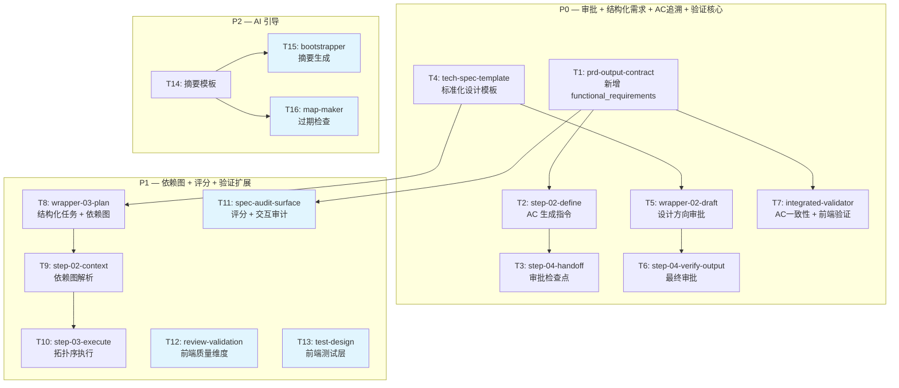

# 主流程质量门禁 — 实施计划

## 实施策略

按优先级分 3 批交付，每批内部按依赖拓扑排序执行。批次间无阻塞依赖——P1 不必等 P0 全部完成，但同批内的前置任务必须先做。

- **P0**（F-1/F-2/F-3/F-7 核心）：审批门禁 + 结构化需求 + AC 追溯 + 验证层核心
- **P1**（F-4/F-5/F-7 扩展）：任务依赖图 + 审计评分 + 验证层扩展
- **P2**（F-6）：AI 引导增强

---

## 实施任务

### P0 批次

- [x] T1: 扩展 prd-output-contract.md，新增 functional_requirements 可选字段 → _需求: AC-F2-1, AC-F2-4_
  - 在现有 10 字段的 prd_output_package 中追加 functional_requirements 结构
  - 字段包含：id、name、user_story、acceptance_criteria（含 AC 编号）、boundary_cases
  - 保持可选——简单任务该字段为空

- [x] T2: 修改 step-02-define.md，新增结构化 AC 生成指令 → _需求: AC-F2-1, AC-F2-2, AC-F2-3, AC-F2-5_
  - 在核心对象和边界定义之后，增加"结构化验收标准生成"指令块
  - 定义触发条件（何时生成 vs 不生成）
  - 定义 AC 格式约束（EARS 式 "当/若" + AC-F{N}-{M} 编号）
  - 定义交互流程（一次性展示初版，用户增删改，不逐条追问）

- [x] T3: 修改 step-04-handoff.md，新增审批检查点 → _需求: AC-F1-1, AC-F1-2, AC-F1-5_
  - 在 Ready Gate 通过后、交接前插入审批指令
  - 展示产物摘要（核心对象 + InScope/OutScope + 关键 AC）
  - 等待明确确认（拒绝模糊回复）
  - 修改请求时回到 step-02
  - 记录 approval_log（YAML 格式）

- [x] T4: 替换 tech-spec-template.md 为标准化设计模板 → _需求: AC-F3-1, AC-F3-2, AC-F3-5_
  - 定义 5 个必须小节：Overview、需求覆盖表、架构图（Mermaid）、组件职责表（含「覆盖 AC」列）、设计决策表
  - 定义推荐小节（数据流图、接口定义、数据模型、错误处理等）
  - 内容来自 context/design_template_preview.md

- [x] T5: 修改 wrapper-02-draft.md，增强设计方向审批 → _需求: AC-F1-3_
  - 修改现有 Proceed|Edit|Retry 逻辑
  - 展示技术 + 交互设计关键决策摘要
  - 记录 approval_log

- [x] T6: 修改 step-04-verify-output.md，新增最终审批 → _需求: AC-F1-4, AC-F1-5_
  - 扩展文件存在性检查（交互文档可选）
  - 新增"进入实施审批"：展示 spec 产出概要 → 用户确认
  - 记录 approval_log

- [x] T7: 修改 integrated-validator，AC 一致性检查 + Layer 3 前端增强 → _需求: AC-F3-4, AC-F7-1_
  - 新增 AC 引用一致性检查：扫描下游文档中的 AC 引用 vs 源需求
  - 增强 Layer 3 前端验证：组件一致性、UI 状态覆盖、Props/Events 契约、可访问性基线
  - 不存在的引用标 CRITICAL，未覆盖 AC 标 WARNING

### P1 批次

- [x] T8: tech-spec-template.md §03 plan 区段已包含结构化任务 + 依赖图格式（由 T4 一并实现） → _需求: AC-F3-3, AC-F4-1, AC-F4-2_
  - 定义「实施任务」区段格式（checkbox + 编号 + 描述 + AC 引用）
  - 定义「任务依赖」区段（Mermaid flowchart，>3 个任务时必须）
  - 规则：最多 2 层层级、只含编码任务、蓝色标注可并行

- [x] T9: 修改 step-02-context.md，新增依赖图解析 → _需求: AC-F4-3_
  - 解析 03_plan.md 中 Mermaid flowchart 的任务节点和依赖边
  - 拓扑排序确定执行顺序
  - 标记可并行任务组
  - 无依赖图时保持当前行为

- [x] T10: 修改 step-03-execute.md，改为拓扑序执行 + checkbox 写回 → _需求: AC-F4-3, AC-F4-4_
  - 有依赖图时：按拓扑序执行（当前仍串行）
  - 完成后标记 `[x]`，只改 checkbox 状态
  - 无依赖图时：保持原行为

- [x] T11: 修改 spec-audit-surface step-04，评分输出 + 交互审计 → _需求: AC-F5-1, AC-F5-2, AC-F5-3, AC-F5-4, AC-F7-2_
  - 新增 4 维评分（完整性/清晰度/可行性/一致性，各 25 分）
  - 固定表格输出格式 + 综合分 + 最低维度高亮
  - 写入 context/audit_score.md
  - 新增交互 spec 审计：状态完整性、跨系引用有效性、响应式/可访问性检查

- [x] T12: 修改 review-validation-surface step-02，前端质量维度 → _需求: AC-F7-3_
  - 新增：组件状态管理检查（异步状态/状态突变）
  - 新增：可访问性实现检查（label/键盘/aria-live）
  - 新增：响应式实现检查（媒体查询/条件渲染）
  - 仅当项目含前端代码时触发

- [x] T13: 修改 test-design-surface step-03，前端测试层 → _需求: AC-F7-4_
  - 新增 4 个前端测试层：组件交互 / UI 状态转换 / 可访问性 / 快照回归
  - 含工具建议（@testing-library、axe-core 等）
  - 快照测试为可选推荐

### P2 批次

- [x] T14: 新增 repository_map.md AI 引导摘要模板 → _需求: AC-F6-1_
  - 定义摘要结构：产品上下文 / 技术约定 / 代码结构
  - 每个仓库摘要 ≤ 20 行
  - 标注生成日期和生成方式

- [x] T15: 修改 maglev-bootstrapper Phase 2，自动生成摘要 → _需求: AC-F6-2_
  - 扫描 README + package.json + 目录结构
  - 展示给用户确认后写入 repository_map.md

- [x] T16: 修改 maglev-map-maker，过期检查 → _需求: AC-F6-3_
  - 对比当前 dependencies / 目录结构 vs 摘要记录
  - 显著变化时提醒用户重新生成

---

## 任务依赖

蓝色节点为可并行任务（无互相依赖）。

### 并行机会

| 批次 | 可并行组 | 备注 |
|------|---------|------|
| P0 | T1→T2→T3 与 T4→T5→T6 | 两条链完全独立，可并行 |
| P0 | T7 在 T1 完成后即可开始 | 与 T4~T6 链并行 |
| P1 | T11、T12、T13 互相独立 | 可同时进行 |
| P1 | T8→T9→T10 串行链 | T8 依赖 T4（P0） |
| P2 | T15、T16 互相独立 | 均依赖 T14 |

---

## AC 全覆盖追溯

| AC | 实施任务 |
|----|---------|
| AC-F1-1 | T3 |
| AC-F1-2 | T3 |
| AC-F1-3 | T5 |
| AC-F1-4 | T6 |
| AC-F1-5 | T3, T5, T6 |
| AC-F2-1 | T1, T2 |
| AC-F2-2 | T2 |
| AC-F2-3 | T2 |
| AC-F2-4 | T1 |
| AC-F2-5 | T2 |
| AC-F3-1 | T4 |
| AC-F3-2 | T4 |
| AC-F3-3 | T8 |
| AC-F3-4 | T7 |
| AC-F3-5 | T4 |
| AC-F4-1 | T8 |
| AC-F4-2 | T8 |
| AC-F4-3 | T9, T10 |
| AC-F4-4 | T10 |
| AC-F5-1 | T11 |
| AC-F5-2 | T11 |
| AC-F5-3 | T11 |
| AC-F5-4 | T11 |
| AC-F6-1 | T14 |
| AC-F6-2 | T15 |
| AC-F6-3 | T16 |
| AC-F7-1 | T7 |
| AC-F7-2 | T11 |
| AC-F7-3 | T12 |
| AC-F7-4 | T13 |

全部 30 个 AC 均有对应任务覆盖。

---

## 风险与缓解

| 风险 | 影响 | 缓解 |
|------|------|------|
| 审批点过多导致用户疲劳 | F-1 体验退化 | 审批展示精简（关键 AC 前 3 条），后续可增加快速模式 |
| AC 格式对简单任务过重 | F-2 采用率低 | 可选字段（AC-F2-4），简单任务不触发 |
| Mermaid 依赖图 AI 生成质量不稳定 | F-4 可靠性 | 依赖图为"最优努力"——解析失败时退回列表顺序 |
| 验证层前端检查为指令级（AI 理解型） | F-7 覆盖率依赖模型能力 | 检查项从明确可判断的模式入手（文件存在、关键字匹配），不做语义推断 |
| 多技能同时修改引入不一致 | 整体 | P0 先实施并验证一轮后再推 P1 |

---

## 验收方式

每个任务完成后，通过以下方式验收：

1. **文件级**：目标 step/template 文件包含设计方案中描述的指令内容
2. **流程级**：使用 spec-designer 对一个示例项目走完完整流程，确认门禁触发、AC 生成、追溯链完整
3. **回归级**：用一个简单任务（不含结构化 AC）走同一流程，确认不受影响（NFR-2）
