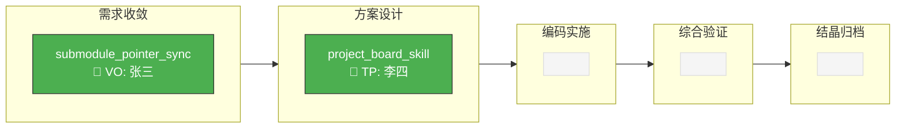

# 技术蓝图: project_board_skill

> 👤 **Executive Brief**
>
> 新建 `project-board` 标准 Skill，通过扫描 spec 目录 + git 证据 + 测试文件的交叉验证，
> 自动判断每个活跃需求所处的主流程阶段，并映射铁三角角色状态。
> 输出为固定格式的 Markdown 看板（总看板 + 子看板），缓存结果以避免重复查询。
>
> **核心 Trade-off**: 判断精度 vs 查询成本 → 采用"证据层级 + 缓存"策略。
> **显性风险**: git log 查询在大仓库中较慢；内容质量启发式判断可能误判。

---

## 1. 多态策略

**Frontend**: N/A (Headless / Agent Skill)

**策略**: Agent / Workflow — Skill 的逻辑以 SKILL.md + references/ 文件定义，由 AI Agent 执行。无独立运行时代码。

---

## 2. 架构总览

### 2.1 组件结构

```
project-board/
├── SKILL.md                          # Skill 入口与概览
└── references/
    ├── board.workflow.md              # 工作流编排
    ├── step-01-scan.md               # 活跃需求扫描
    ├── step-02-judge-stage.md        # 流程阶段判断
    ├── step-03-map-roles.md          # 角色状态映射
    ├── step-04-render-board.md       # 看板渲染与持久化
    ├── stage-evidence-rules.md       # 阶段证据规则参考
    └── board-template.md             # Mermaid 看板模式模板（固定部分）
```

### 2.2 数据流

```
specs/20_evolution/active/  ─┐
issues/active/              ─┤ → [Scanner] → ActiveItem[]
                             │
specs/10_reality/team.md   ──┤ → [Role Mapper]
                             │
git log / test files       ──┤ → [Stage Judger]
                             │
                             └──→ [Board Renderer] → board.md + status.md[]
                                                   → board_cache.json (temp)
```

---

## 3. 核心模块设计

### 3.1 Module: Scanner (F-1)

**输入**: 项目根路径
**输出**: `ActiveItem[]`

```typescript
// 伪结构，实际由 AI Agent 执行
interface ActiveItem {
  name: string;           // spec 目录名 或 issue 文件名
  path: string;           // 相对路径
  type: 'spec' | 'issue'; // 来源类型
  intent: string;         // 从 00_intent.md 或 issue 首行提取
  files: string[];        // 该目录下已有的文件列表
  parent?: string;        // 父需求 name（若有）
  children?: string[];    // 子需求 name 列表（若有）
}
```

**扫描逻辑**:

1. 列出 `specs/20_evolution/active/` 下的子目录
2. 对每个子目录，检查 `00_intent.md` 是否存在 → 提取意图摘要
3. 列出 `issues/active/` 下的文件
4. 对每个 issue 文件，检查是否在 active/ 下有同名 spec 目录
   - 有 → 跳过（已由 spec 覆盖）
   - 无 → 标记为 `type: issue`（未启动需求）

### 3.2 Module: Stage Judger (F-2)

**输入**: `ActiveItem`
**输出**: `StageResult`

```typescript
interface StageResult {
  current_stage: Stage;
  progress: StageProgress[];   // 5 个阶段各自的完成状态
  progress_display: string;    // emoji 进度条（如 ✅→✅→⏳→⬜→⬜）
  confidence: 'confirmed' | 'inferred' | 'uncertain';
  evidence: Evidence[];
  missing: string[];
}

type Stage =
  | '需求收敛'
  | '方案设计'
  | '编码实施'
  | '综合验证'
  | '结晶归档';

interface StageProgress {
  stage: Stage;
  status: 'completed' | 'in_progress' | 'not_started';
  evidence: Evidence[];
}

interface Evidence {
  type: 'file' | 'content' | 'git' | 'test';
  source: string;
  signal: string;
}
```

**全段评估规则**（逐阶段独立评估，不是"命中即停"）:

| 优先级 | 阶段 | 文件证据 | 内容质量 | 代码证据 | 测试证据 |
|--------|------|---------|---------|---------|---------|
| 5 | 结晶归档 | 所有 spec 文件齐备 | 有验证记录 | 有实质提交 | 有通过记录 |
| 4 | 综合验证 | `02_design.md` 存在 | 有架构决策内容 | 有实质提交 | 有测试文件 |
| 3 | 编码实施 | `02_design.md` 存在 | 有架构决策内容 | 有相关提交 | - |
| 2 | 方案设计 | `01_requirements.md` 存在 | 有 FR/AC 定义 | - | - |
| 1 | 需求收敛 | `00_intent.md` 存在 | 有问题陈述 | - | - |
| 0 | 需求收敛 | 仅 issue 文件 | - | - | - |

> **注意**：已归档的 spec（在 `90_archive/` 下）不参与看板。归档由 crystallization 负责。

**内容质量启发式**:

- 文件 > 20 行有效内容（排除空行和纯 Markdown 结构行）
- 存在关键标记词：
  - `01_requirements.md`: 检查是否有 `## 功能需求` 或 `### F-` 开头的章节
  - `02_design.md`: 检查是否有 `## 架构` 或 `## 设计决策` 类章节
  - 验证记录: 检查是否有 `integrated-validator` 相关输出

**代码证据查询**:

```bash
# 缓存策略：结果写入 board_cache.json，有效期内不重复查询
# 排除看板自身产出文件，避免自证预言
git --no-pager log --oneline --since="90 days ago" -- "**/{spec_name}*" ":!specs/20_evolution/active/*/status.md" ":!specs/20_evolution/board.md" | head -5
```

- 若返回 ≥1 条提交 → code_evidence = true
- 查询范围限制为最近 90 天，覆盖常规 spec 生命周期

**不确定性处理 (AC-F2-3)**:

当相邻两个阶段的证据都不充分时：
- `confidence = 'uncertain'`
- 标记为"阶段待确认"
- 在 evidence 中列出已有和缺失的证据

### 3.3 Module: Role Mapper (F-3)

**输入**: `ActiveItem` + `StageResult`
**输出**: `RoleMapping`

```typescript
interface RoleMapping {
  vo: RoleStatus;
  tp: RoleStatus;
  xg: RoleStatus;
}

interface RoleStatus {
  person: string | null;   // 人员名称（若配置了映射）
  status: '主导中' | '待介入' | '已完成' | '未参与';
}
```

**数据源层级**:

1. **项目级配置（主）**: `specs/10_reality/team.md`

```yaml
# specs/10_reality/team.md 格式约定
---
team:
  vo: { name: "张三", title: "产品经理" }
  tp: { name: "李四", title: "前端工程师" }
  xg: { name: "王五", title: "测试工程师" }
---
```

2. **Spec 级覆盖（辅）**: 若 spec 目录下有 `team.yaml` 或 `00_intent.md` 含 `## 角色` 节

读取优先级：spec 级 > 项目级 > 未配置（仅显示角色代号）

**阶段→角色状态映射规则**:

| 阶段 | VO | TP | XG |
|------|----|----|-----|
| 需求收敛 | 主导中 | 待介入 | 未参与 |
| 方案设计 | 已完成 | 主导中 | 待介入 |
| 编码实施 | 已完成 | 主导中 | 待介入 |
| 综合验证 | 已完成 | 已完成 | 主导中 |
| 结晶归档 | 已完成 | 已完成 | 已完成 |

### 3.4 Module: Board Renderer (F-4, F-5, F-7)

**总看板输出** → `specs/20_evolution/board.md`:

看板使用 **Mermaid 流程图**作为核心视图。模式（结构/样式/阶段列）固定，数据（需求位置/角色标注）动态填充。

**Mermaid 模板模式（固定部分）**:

模式定义存储在 `references/board-template.md` 中，与数据分离。

核心模式结构：
- `graph LR` 布局，5 个阶段子图从左到右
- 3 个样式类：`active`（绿色，当前所在阶段）、`waiting`（灰色，空阶段占位）、`uncertain`（橙色，阶段待确认）
- 每个需求节点显示：名称 + 主导角色 + 人员
- 阶段间有方向箭头表示流转方向

**数据填充示例**:

````markdown

````

**Mermaid 模式治理规则**:

1. **数据更新**（需求移动/新增/归档）→ 自动执行，不需确认
2. **模式变更**（增减阶段列、修改样式类、调整布局方向）→ 必须 AI + 用户确认后执行
3. 用户可通过修改模板文件自定义项目看板样式，但需通过确认流程

**辅助 Markdown 表格**（降级补充，用于终端不支持 Mermaid 渲染时）:

```markdown
## 需求明细

| 需求 | 阶段 | 信心度 | 主导 | 证据摘要 |
|------|------|--------|------|----------|
| {name} | {stage} | {confidence} | {role} ({person}) | {evidence} |
```

**格式约束 (AC-F5-3)**:
- Mermaid 图为主视图，Markdown 表为降级补充
- 阶段待确认时使用 `:::uncertain` 样式类（橙色标记）
- 空阶段保留占位节点，维持布局稳定
- 表头结构固定，不随内容变化

**子看板输出** → `specs/20_evolution/active/{spec}/status.md`:

```markdown
# 状态: {spec_name}

> 最后更新: {timestamp}

## 当前阶段

{stage} ({confidence})

## 证据

| 类型 | 来源 | 信号 |
|------|------|------|
| {type} | {source} | {signal} |

## 角色状态

| 角色 | 人员 | 状态 |
|------|------|------|
| VO | {person} | {status} |
| TP | {person} | {status} |
| XG | {person} | {status} |

## 已知阻塞

- {blocker_description}（无则写"无"）
```

### 3.5 Caching Strategy

**缓存文件**: `.maglev/temp/board_cache.json`

```json
{
  "last_full_update": "2026-04-15T10:30:00+08:00",
  "items": {
    "project_board_skill": {
      "stage": "方案设计",
      "confidence": "confirmed",
      "updated_at": "2026-04-15T10:30:00+08:00",
      "evidence_hash": "abc123"
    }
  }
}
```

**缓存策略**:
- git 查询结果缓存到 board_cache.json
- 每次更新时先读缓存，仅对"文件证据发生变化"的条目重新查询 git
- 时间戳标注在总看板和子看板中，让阅读者判断时效性
- 不设自动过期——由显式更新触发刷新

---

## 4. 集成设计

### 4.1 与 reality-sync 集成

**触发点**: reality-sync 的 step-01-sync.md 执行过程中

**集成方式**: 在 reality-sync 的同步步骤中增加"读取 board.md"：
- 检查 `specs/20_evolution/board.md` 是否存在
- 若存在，读取并展示摘要（需求数、各阶段分布）
- 不触发 board 更新（避免启动延迟），仅展示缓存数据

**修改范围**: reality-sync 的 `references/step-01-sync.md`，追加一个读取步骤

### 4.2 与 crystallization 集成

**触发点**: crystallization 完成归档后

**集成方式**: 在 crystallization 的归档步骤末尾增加调用：
- 调用 project-board 的更新流程
- 目的: 将已归档的 spec 从总看板中移除，同步子看板

**修改范围**: crystallization 的 SKILL.md 或相关 step 文件，追加一个后置步骤

### 4.3 集成契约

```yaml
# 其他 Skill 调用 board 更新的标准方式
integration:
  trigger: "调用 project-board Skill 执行看板更新"
  input: null  # 无需传参，Skill 自行扫描
  output: board.md + status.md[] 已更新
  side_effects:
    - board_cache.json 刷新
    - board.md 写入变更摘要
```

---

## 5. 设计决策记录

| # | 决策 | 选项 | 选择 | 理由 |
|---|------|------|------|------|
| D-1 | 阶段判断策略 | A) 纯文件存在 B) 文件+内容质量+git | B | 用户明确要求"文件存在是必要不充分条件" |
| D-2 | 查询策略 | A) 每次实时 B) 缓存+时间戳 | B | 用户确认允许缓存，避免大仓库查询成本 |
| D-3 | 人员配置来源 | A) 项目级 B) spec 级 C) A+B | C | 项目级为主，spec 级覆盖特殊情况 |
| D-4 | Skill 集成方式 | A) 嵌入 B) 独立+读取 | B | 独立 Skill 更新，reality-sync 只读取展示 |
| D-5 | 归档处理 | A) crystallization 调用 B) board 自检 | A | 用户确认由 crystallization 触发 |
| D-6 | 看板格式 | A) Markdown 表格 B) Mermaid 图 C) 混合 | B | Mermaid 图视觉稳定、可定制；模式固定 + 数据动态填充 |
| D-7 | 格式变更治理 | A) 自由修改 B) AI+人确认 | B | 格式模板变更需 AI + 用户共同确认，数据更新不需要 |

---

## 6. 约束与风险

| 风险 | 影响 | 缓解 |
|------|------|------|
| git log 在大仓库中慢 | 更新耗时增加 | 限制查询范围（90天）+ 缓存 + 排除看板产出 |
| 内容质量启发式误判 | 阶段判断不准 | confidence 标记 + "阶段待确认"提示 |
| team.md 不存在 | 角色只显示代号 | 降级展示，不阻塞看板生成 |
| board.md 与实际不同步 | 信息过时 | 时间戳标注 + 变更摘要 |

---

## 7. 待验证点

- [ ] 内容质量启发式（20行阈值 + 关键标记词）在实际仓库中的准确率
- [x] git log 路径匹配模式是否能可靠关联 spec 与代码变更 → 已加排除规则，避免自证预言
- [ ] 多 spec 并行推进时的看板可读性（超过 10 行是否需要分组）
- [x] team.md 的 YAML frontmatter 格式是否与现有仓库约定兼容 → 已实测通过
