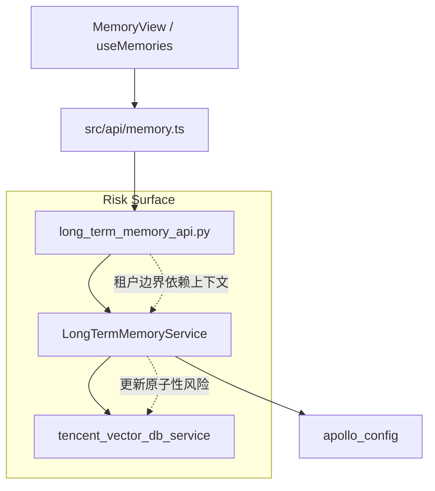
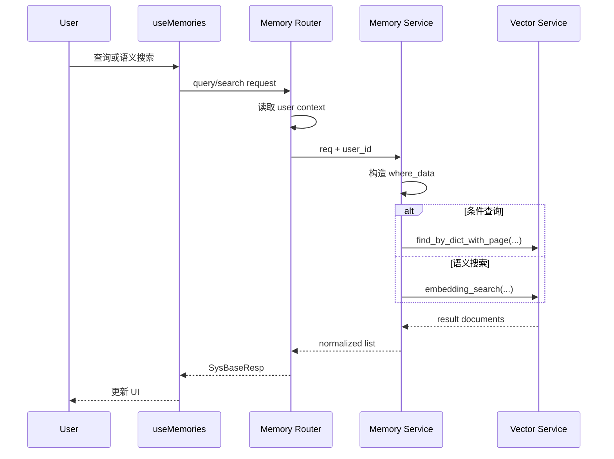
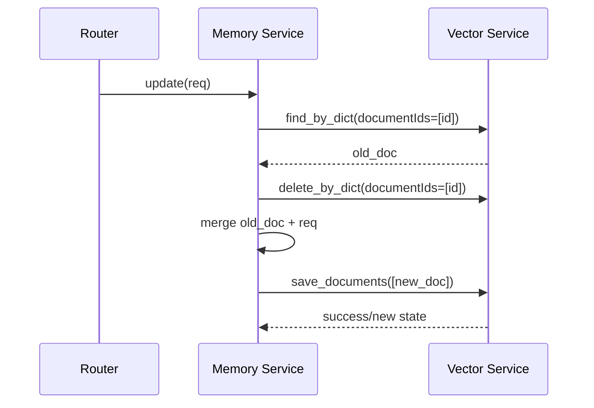
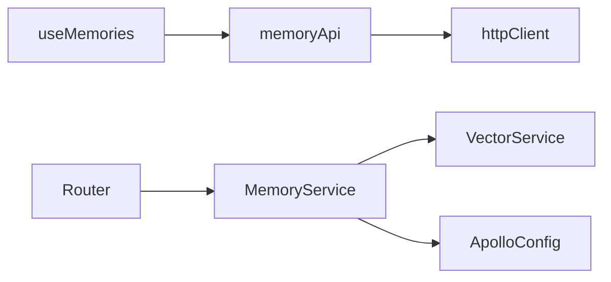

# Design - Memory 记忆中心

## 1. Architecture Overview
- 前端通过 `memory.ts` 访问长期记忆后端接口，并由 `useMemories` 管理列表和搜索状态。
- 后端路由层负责接入和统一响应包装，服务层直接调用向量数据库服务完成存取和检索。
- 当前架构上未观察到独立的关系型持久层、异步任务补偿层或缓存层显式接入。

### 1.1 Architecture Diagram


### 1.2 File Structure
```text
memory_center/
  backend/
    api/router/long_term_memory_api.py
    service/long_term_memory_service.py
    domain/req/long_term_memory_req.py
    domain/resp/long_term_memory_resp.py
    config/apollo_config.py
  frontend/
    src/api/memory.ts
    src/composables/useMemories.ts
    src/types/memory.ts
```

## 2. Feature Map
- `POST /long-term-memory`: 创建
- `PUT /long-term-memory`: 更新
- `DELETE /long-term-memory/{doc_id}`: 删除
- `GET /long-term-memory/{doc_id}`: 单条详情
- `POST /long-term-memory/query`: 条件列表查询
- `POST /long-term-memory/search`: 语义检索
- `useMemories.fetchMemories()`: 前端拉取列表
- `useMemories.searchMemoriesSemanticly()`: 前端发起语义搜索
- `useMemories.removeMemory()`: 前端删除并更新本地数组

## 3. Data Structure Map

### 3.1 Core Structures
| Name | Kind | Defined In | Purpose |
|---|---|---|---|
| LongTermMemoryCreateReq | Request DTO | `pcp-mpx/pcp_mpx/domain/req/long_term_memory_req.py` | 创建请求 |
| LongTermMemoryUpdateReq | Request DTO | `pcp-mpx/pcp_mpx/domain/req/long_term_memory_req.py` | 更新请求 |
| LongTermMemoryQueryReq | Request DTO | `pcp-mpx/pcp_mpx/domain/req/long_term_memory_req.py` | 列表过滤请求 |
| LongTermMemorySearchReq | Request DTO | `pcp-mpx/pcp_mpx/domain/req/long_term_memory_req.py` | 语义搜索请求 |
| LongTermMemoryDetailResp | Response DTO | `pcp-mpx/pcp_mpx/domain/resp/long_term_memory_resp.py` | 详情响应 |
| LongTermMemoryListResp | Response DTO | `pcp-mpx/pcp_mpx/domain/resp/long_term_memory_resp.py` | 列表响应 |
| LongTermMemory | Frontend Type | `mpx-web/src/types/memory.ts` | 前端主结构 |
| MemorySearchResult | Frontend Type | `mpx-web/src/types/memory.ts` | 搜索结果结构 |
| service_doc | Runtime Document | `pcp-mpx/pcp_mpx/service/long_term_memory_service.py` | 写入向量库的实际文档 |

### 3.2 Data Dictionary
| Structure | Field | Type | Required | Meaning | Notes |
|---|---|---|---|---|---|
| service_doc | id | string | yes | 文档主键 | `uuid4()` 生成 |
| service_doc | text | string | yes | 记忆正文 | 向量化源文本 |
| service_doc | user_id | string | yes | 用户边界 | 查询/搜索过滤关键字段 |
| service_doc | memory_type | string | yes | 业务类型 | 当前未见严格后端枚举 |
| service_doc | time_scope | string | no | 时间范围标识 | 默认空串 |
| service_doc | date_key | string | yes | 日期键 | 默认当天 |
| service_doc | created_at | string | yes | 创建时间 | 字符串时间戳 |
| LongTermMemoryQueryReq | page_number | int | yes | 页码 | 默认 1 |
| LongTermMemoryQueryReq | page_size | int | yes | 页大小 | 默认 10 |
| MemorySearchResult | score | number | yes | 相似度得分 | 仅前端类型中存在 |

### 3.3 Cross-Layer Mapping
- `LongTermMemoryCreateReq` -> `service_doc`
- `service_doc` -> 向量服务存储对象
- 向量服务查询结果 -> `LongTermMemoryDetailResp`
- `LongTermMemoryDetailResp` -> 前端 `LongTermMemory`
- 检索结果 + `score` -> `MemorySearchResult`

### 3.4 Data Risks
- 前端类型声明 `user_id` 为入参字段，但后端实际从上下文注入。
- 前端查询参数使用 `limit`，后端模型为 `page_number/page_size`。
- 后端响应模型未显式声明 `score`，而前端搜索类型需要它。

## 4. Main Flow
1. 页面或组合式函数调用 `queryMemories` / `searchMemories` / `deleteMemory`。
2. HTTP 请求进入 `long_term_memory_api.py`。
3. 路由层从 `get_user_context().domain_account` 获取当前用户。
4. 服务层构造过滤条件或待写入文档。
5. 向量服务执行列表查询、embedding search、删除或保存。
6. 路由层包装为 `SysBaseResp` 返回。
7. 前端根据 `result_code` 更新 `memories` 和 `loading`。

### 4.1 Query / Search Sequence


### 4.2 Update Sequence


## 5. State Machine
| State | Trigger | Next State | Guard |
|---|---|---|---|
| idle | fetch/search start | loading | 请求触发 |
| loading | response success | ready | `result_code=success` |
| loading | response error | idle-with-log | 仅打印日志 |
| ready | delete success | ready | 本地数组过滤 |

### 5.1 Hidden State
- 向量库中文档是否“已索引完成”没有显式状态字段。
- 更新过程中的“旧文档已删、新文档未写入”窗口没有显式状态表达。

## 6. Dependency Topology
- `useMemories.ts` -> `src/api/memory.ts`
- `src/api/memory.ts` -> `../utils/http`
- `long_term_memory_api.py` -> `long_term_memory_service`
- `long_term_memory_service` -> `tencent_vector_db_service`
- `long_term_memory_service` -> `apollo_config`

### 6.1 Dependency Diagram


## 7. Runtime Behavior

### 7.1 Write Path
- 创建和更新都直接写向量服务，没有看到独立异步队列。
- 更新是“删旧写新”双操作，不是原地更新。

### 7.2 Query Path
- 列表查询基于 metadata filter + sort。
- 语义检索基于 `embedding_search`，并按 `limit` 返回。

### 7.3 Concurrency / Atomicity
- 更新路径存在潜在短暂空窗：删除成功但新文档写入失败时，文档可能丢失。
- 删除和更新没有显式幂等保护或版本校验。

### 7.4 Frontend Runtime
- 仅有 `loading` 状态，无独立错误态、重试态或空态枚举。

## 8. Error Taxonomy
- 输入错误: 请求字段不合法，由 Pydantic/FastAPI 拦截。
- 资源不存在: `update/get_by_id` 在返回 `None` 时转为 404。
- 向量服务异常: 当前由异常直接冒泡或在前端被 `catch` 后打印日志。
- 契约漂移错误: 前后端类型不一致可能导致运行时数据解析异常，但当前前端有较多 `any` 容错。

## 9. Security Surface
- 正向保护:
  - 查询和语义检索显式强制拼入 `user_id`
  - 路由层通过上下文而非请求体读取当前用户
- 风险点:
  - `update/delete/get_by_id` 当前代码未显式传入 `user_id` 过滤
  - 如果向量服务不做二次校验，可能存在跨用户 ID 访问风险

## 10. Configuration Matrix
| Config | Source | Purpose | Risk |
|---|---|---|---|
| `vector_db.tencent.collection.long-memory-name` | `apollo_config` | 决定长期记忆 collection 名称 | 环境切换可能影响数据面 |

## 11. Observability Map
- 已见日志:
  - 前端 `console.error('Failed to ...')`
  - 后端文件中定义了 `log`，但当前片段未见关键业务日志
- 未见明确指标:
  - 查询耗时
  - 写入耗时
  - 检索命中率
  - 错误率

## 12. Test Mapping
- 当前扫描范围内未见直接覆盖长期记忆模块的测试用例。
- 因此以下行为无法通过现有证据确认：
  - 跨用户隔离
  - 更新原子性
  - 检索分数结构
  - 参数兼容行为

## 13. Change Risk
- 高风险 1: 前后端契约漂移隐藏在 `any` 和弱类型兼容中，重构容易破。
- 高风险 2: 更新路径的“删旧写新”在异常时可能导致数据丢失。
- 高风险 3: 租户隔离在部分操作上依赖隐式服务能力，缺少显式代码证据。

## 14. Assumptions / Unknowns
- [INFERENCE] 当前模块把向量服务当作主存储，而不仅仅是搜索索引。
- [UNKNOWN] 向量服务内部是否对 `documentIds` 查询/删除自动带权限边界。
- [UNKNOWN] `embedding_search` 返回的一层/二维结构在不同环境是否一致。
- [UNKNOWN] 当前是否存在后台任务负责记忆创建与更新，而前端仅消费。

## 15. Implementation Trace
- `pcp-mpx/pcp_mpx/api/router/long_term_memory_api.py`
- `pcp-mpx/pcp_mpx/service/long_term_memory_service.py`
- `pcp-mpx/pcp_mpx/domain/req/long_term_memory_req.py`
- `pcp-mpx/pcp_mpx/domain/resp/long_term_memory_resp.py`
- `mpx-web/src/api/memory.ts`
- `mpx-web/src/composables/useMemories.ts`
- `mpx-web/src/types/memory.ts`
