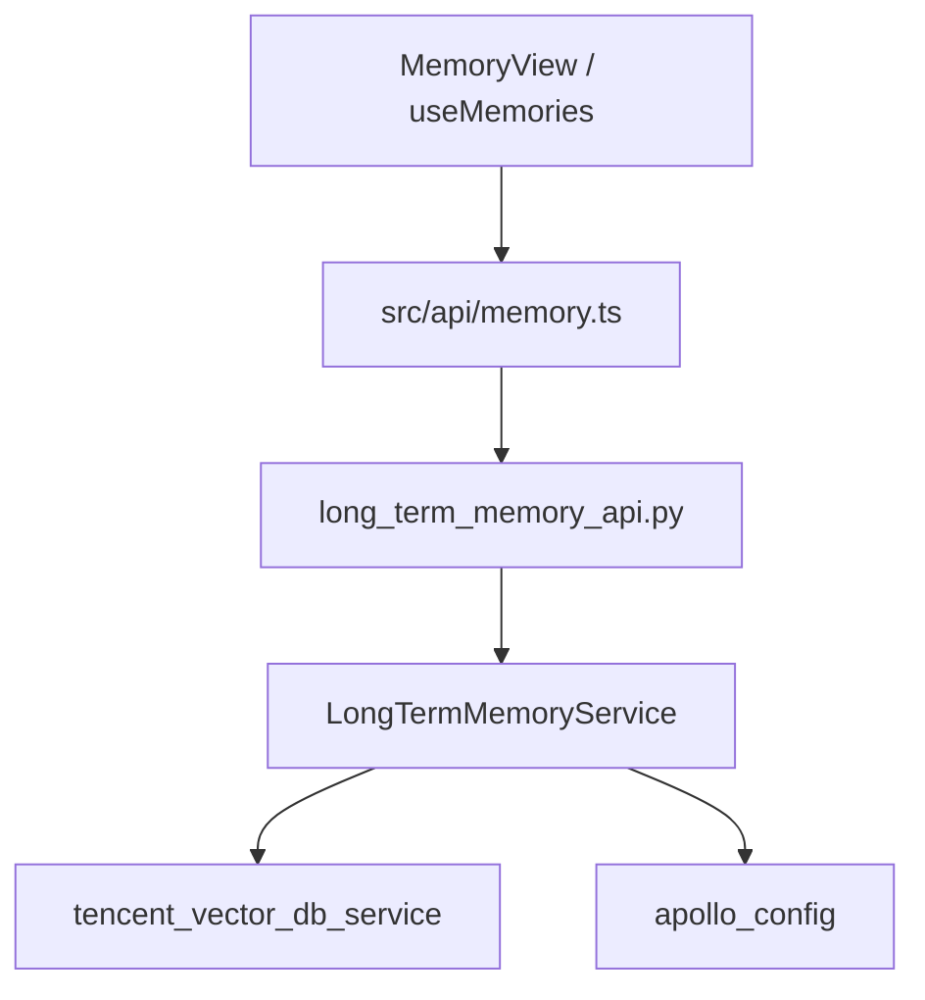
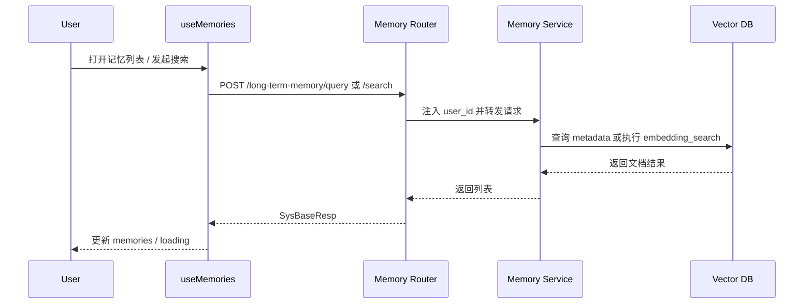

# Design - Memory 记忆中心

## 1. Architecture Overview
- 前端通过 `mpx-web/src/api/memory.ts` 调用长期记忆后端接口。
- 路由层 `long_term_memory_api.py` 负责请求接入、用户上下文提取和响应包装。
- 服务层 `LongTermMemoryService` 负责文档拼装、向量存储调用、条件查询和语义检索。
- 底层依赖 `tencent_vector_db_service` 作为统一向量存储入口。

### 1.1 Architecture Diagram


### 1.2 File Structure
```text
memory_center/
  backend/
    api/router/long_term_memory_api.py
    service/long_term_memory_service.py
    domain/req/long_term_memory_req.py
    domain/resp/long_term_memory_resp.py
  frontend/
    src/api/memory.ts
    src/composables/useMemories.ts
    src/types/memory.ts
```

## 2. Feature Map
- `POST /long-term-memory`: 创建长期记忆
- `PUT /long-term-memory`: 更新长期记忆
- `DELETE /long-term-memory/{doc_id}`: 删除长期记忆
- `GET /long-term-memory/{doc_id}`: 查询单条记忆
- `POST /long-term-memory/query`: 条件查询列表
- `POST /long-term-memory/search`: 语义检索
- `useMemories.fetchMemories()`: 拉取列表
- `useMemories.searchMemoriesSemanticly()`: 语义搜索
- `useMemories.removeMemory()`: 删除并更新前端状态

## 3. Data Structure Map

### 3.1 Core Structures
| Name | Kind | Defined In | Purpose |
|---|---|---|---|
| LongTermMemoryCreateReq | Request DTO | `pcp-mpx/pcp_mpx/domain/req/long_term_memory_req.py` | 创建记忆入参 |
| LongTermMemoryUpdateReq | Request DTO | `pcp-mpx/pcp_mpx/domain/req/long_term_memory_req.py` | 更新记忆入参 |
| LongTermMemoryQueryReq | Request DTO | `pcp-mpx/pcp_mpx/domain/req/long_term_memory_req.py` | 条件查询入参 |
| LongTermMemorySearchReq | Request DTO | `pcp-mpx/pcp_mpx/domain/req/long_term_memory_req.py` | 语义检索入参 |
| LongTermMemoryDetailResp | Response DTO | `pcp-mpx/pcp_mpx/domain/resp/long_term_memory_resp.py` | 记忆详情出参 |
| LongTermMemoryListResp | Response DTO | `pcp-mpx/pcp_mpx/domain/resp/long_term_memory_resp.py` | 记忆列表出参 |
| LongTermMemory | Frontend Type | `mpx-web/src/types/memory.ts` | 前端记忆主结构 |
| MemorySearchResult | Frontend Type | `mpx-web/src/types/memory.ts` | 带 `score` 的前端搜索结果 |

### 3.2 Data Dictionary
| Structure | Field | Type | Required | Meaning | Notes |
|---|---|---|---|---|---|
| LongTermMemoryCreateReq | text | str | yes | 记忆正文 | 创建必填 |
| LongTermMemoryCreateReq | memory_type | str | yes | 记忆类型 | 当前描述指向日/周/月总结 |
| LongTermMemoryCreateReq | time_scope | str | no | 时间范围标识 | 例如周维度标识 |
| LongTermMemoryCreateReq | date_key | str | no | 日期键 | 默认为当天 |
| LongTermMemoryDetailResp | id | str | yes | 记忆文档 ID | 主键 |
| LongTermMemoryDetailResp | text | str | no | 记忆正文 | 详情文本 |
| LongTermMemoryDetailResp | user_id | str | no | 所属用户 | 用于租户隔离 |
| LongTermMemoryDetailResp | memory_type | str | no | 类型标签 | 用于筛选 |
| LongTermMemoryDetailResp | time_scope | str | no | 时间范围 | 前端可选展示 |
| LongTermMemoryDetailResp | date_key | str | no | 日期键 | 用于排序和范围查询 |
| LongTermMemoryDetailResp | created_at | str | no | 创建时间 | 服务层写入 |
| MemorySearchResult | score | number | yes | 相似度得分 | 前端类型中声明，后端列表响应未显式建模 |

### 3.3 Mapping
- `LongTermMemoryCreateReq` -> 服务层 `doc` -> 向量库文档
- 向量库文档 -> `LongTermMemoryDetailResp` -> 前端 `LongTermMemory`
- 语义检索结果 -> `MemorySearchResult`

## 4. Main Flow
1. 前端调用 `queryMemories` 或 `searchMemories`。
2. 路由层从用户上下文提取 `domain_account` 作为 `user_id`。
3. 服务层构建 `where_data`，按条件调用向量库的列表查询或 embedding_search。
4. 路由层将服务结果包装为 `SysBaseResp`。
5. `useMemories` 解析响应并更新本地 `memories` 状态。

### 4.1 Query Flow Diagram


## 5. State Machine
| State | Trigger | Next State | Guard |
|---|---|---|---|
| idle | fetchMemories() | loading | 无 |
| loading | query success | ready | 返回 `result_code=success` |
| loading | search success | ready | 返回 `result_code=success` |
| loading | request error | error-like | 当前未单独持久化错误状态，仅打印日志 |
| ready | removeMemory() success | ready | 本地数组过滤目标 ID |

说明：
- 前端只有 `loading` 显式状态，没有独立 `error` 状态存储。
- 服务层的文档状态也未显式建模为 `indexed/unindexed` 等状态字段。

## 6. Dependency Topology
- Frontend -> `mpx-web/src/api/memory.ts` -> HTTP Client
- Router -> `long_term_memory_service`
- Service -> `tencent_vector_db_service`
- Service -> `apollo_config` 读取 collection 名称
- Service -> `datetime / uuid` 生成默认元数据

## 7. Test Mapping
- 本次扫描范围内未看到与长期记忆模块直接对应的前后端测试文件。
- 当前 `Standard` 档结果只能确认实现结构，不能确认测试覆盖。

## 8. Change Risk
- 风险点 1: 前后端查询/搜索契约看起来存在类型漂移。
- 风险点 2: 查询参数 `limit` 与 `page_size/page_number` 的不一致可能导致前端行为依赖隐式兼容。
- 风险点 3: 语义检索 `score` 字段在前端类型中存在，但后端响应模型未显式声明，容易在重构时丢失。

## 9. Assumptions / Unknowns
- [INFERENCE] 当前长期记忆的主要业务载体是“总结类文本”，而不是任意结构化知识对象。
- [UNKNOWN] 向量库返回结果中是否自动附带 `date_key_number` 和 `score` 等扩展字段。
- [UNKNOWN] 创建/更新接口是否有单独的前端入口，或仅由后台任务/Agent 调用。

## 10. Implementation Trace
- `pcp-mpx/pcp_mpx/api/router/long_term_memory_api.py`
- `pcp-mpx/pcp_mpx/service/long_term_memory_service.py`
- `pcp-mpx/pcp_mpx/domain/req/long_term_memory_req.py`
- `pcp-mpx/pcp_mpx/domain/resp/long_term_memory_resp.py`
- `mpx-web/src/api/memory.ts`
- `mpx-web/src/composables/useMemories.ts`
- `mpx-web/src/types/memory.ts`
