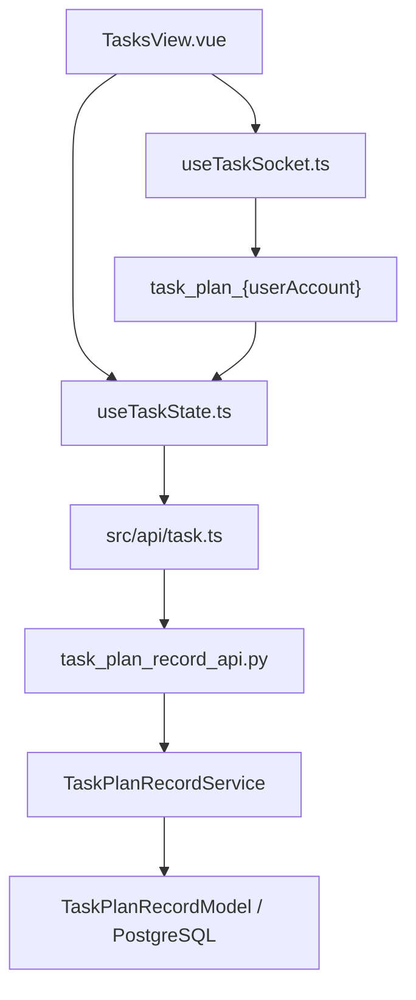
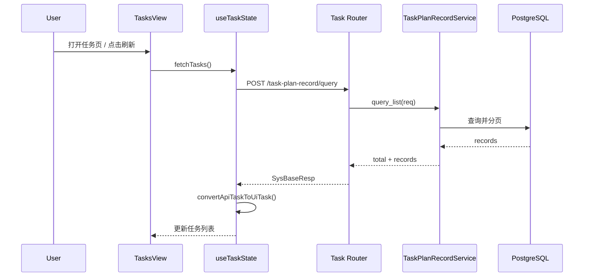
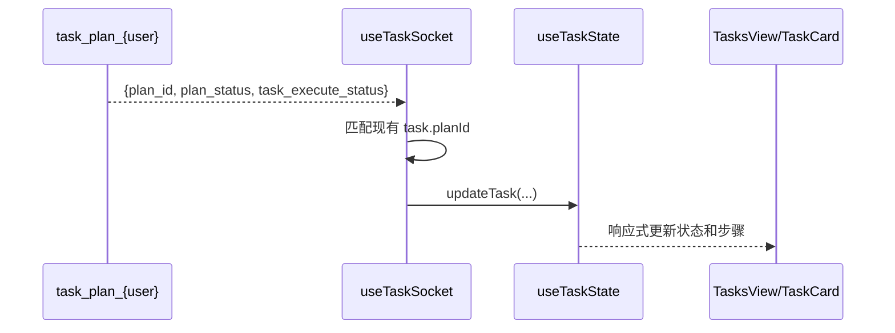

# Design - Tasks 任务管理

## 1. Architecture Overview
- 前端 `TasksView.vue` 负责列表、筛选、刷新和删除确认。
- `useTaskState` 负责 REST 数据加载、类型转换与本地任务状态管理。
- `useTaskSocket` 负责订阅任务状态事件，并把推送合并回全局任务状态。
- 后端 `task_plan_record_api.py` 暴露 CRUD/Query 接口，`TaskPlanRecordService` 处理查询和更新逻辑。
- 数据持久化基于 PostgreSQL `t_task_plan_record` 表。

### 1.1 Architecture Diagram


### 1.2 File Structure
```text
tasks_management/
  backend/
    api/router/task_plan_record_api.py
    service/task_plan_record_service.py
    db/pgsql/models/task_plan_record.py
    domain/req/task_plan_record_req.py
    domain/resp/task_plan_record_resp.py
  frontend/
    src/api/task.ts
    src/composables/useTaskState.ts
    src/composables/useTaskSocket.ts
    src/types/task.ts
    src/views/TasksView.vue
```

## 2. Feature Map
- `POST /task-plan-record`: 创建任务规划记录
- `PUT /task-plan-record`: 更新任务规划记录
- `DELETE /task-plan-record/{plan_id}`: 删除任务规划记录
- `GET /task-plan-record/{plan_id}`: 查询单条记录
- `POST /task-plan-record/query`: 多条件分页查询
- `fetchTasks()`: 前端加载任务列表
- `fetchTaskDetailByPlanId()`: 前端拉单条详情
- `removeTask()`: 删除任务并更新本地状态
- `useTaskSocket.initTaskSocket()`: 订阅实时状态更新

## 3. Data Structure Map

### 3.1 Core Structures
| Name | Kind | Defined In | Purpose |
|---|---|---|---|
| TaskPlanRecordCreateReq | Request DTO | `pcp-mpx/pcp_mpx/domain/req/task_plan_record_req.py` | 创建任务记录 |
| TaskPlanRecordUpdateReq | Request DTO | `pcp-mpx/pcp_mpx/domain/req/task_plan_record_req.py` | 更新任务记录 |
| TaskPlanRecordQueryReq | Request DTO | `pcp-mpx/pcp_mpx/domain/req/task_plan_record_req.py` | 列表查询 |
| TaskPlanRecordModel | DB Model | `pcp-mpx/pcp_mpx/db/pgsql/models/task_plan_record.py` | 持久化主表 |
| TaskPlanRecordResp | Response DTO | `pcp-mpx/pcp_mpx/domain/resp/task_plan_record_resp.py` | 单条响应 |
| TaskPlanRecord | Frontend Type | `mpx-web/src/types/task.ts` | 前端 REST 记录结构 |
| Task | UI Model | `mpx-web/src/composables/useTaskState.ts` | 页面展示结构 |
| WorkflowStep | UI Step Model | `mpx-web/src/composables/useTaskState.ts` | UI 子任务步骤结构 |

### 3.2 Data Dictionary
| Structure | Field | Type | Required | Meaning | Notes |
|---|---|---|---|---|---|
| TaskPlanRecordModel | tpr_id | int | yes | 主键 ID | 自增 |
| TaskPlanRecordModel | plan_id | string | yes | 业务计划 ID | 关键查询键 |
| TaskPlanRecordModel | session_id | string | yes | 会话 ID | 前端可按会话筛选 |
| TaskPlanRecordModel | plan_status | string | no | 计划整体状态 | `created/executing/...` |
| TaskPlanRecordModel | goal | string | no | 任务目标 | 已提示废弃 |
| TaskPlanRecordModel | global_schedule | json | yes | 全局计划 | 应包含 goal |
| TaskPlanRecordModel | tasks | json | yes | 计划蓝图任务列表 | 前端默认按数组读取 |
| TaskPlanRecordModel | task_execute_status | json | no | 运行态列表 | 动态更新 |
| TaskPlanRecordModel | execute_number | int | no | 执行次数 | 重试相关 |
| TaskPlanRecordModel | extend_info | json | no | 扩展上下文 | 故障排查 |
| TaskPlanRecord | created_time | string | yes | 创建时间 | 前端转为时间戳 |
| Task | progress | number | yes | UI 进度 | 由 `plan_status` 计算 |

### 3.3 Cross-Layer Mapping
- `TaskPlanRecordResp` -> `convertApiTaskToUiTask()` -> `Task`
- `tasks` + `task_execute_status` -> `WorkflowStep[]`
- WebSocket `msg.data` -> `updateTask()` -> UI 状态刷新

### 3.4 Data Risks
- 后端 `tasks` 创建时支持 `dict | list`，前端默认按数组处理。
- `TaskPlanRecordResp` 里 `tasks: Optional[List[Any]]`，与请求模型和 DB 模型的宽类型存在潜在漂移。
- 前端 `Task` 的 `status/progress` 是派生值，不是后端原生字段。

## 4. Main Flow
1. 页面初始化后监听 `userInfo`，触发 `fetchTasks()` 和 `initTaskSocket()`。
2. 前端调用 `/task-plan-record/query` 拉取列表。
3. `useTaskState` 将 API 返回的记录转成 UI `Task`。
4. 页面按筛选标签展示任务卡片。
5. 执行过程中，WebSocket 推送状态变化，`useTaskSocket` 合并更新到全局状态。

### 4.1 Query Flow Diagram


### 4.2 Realtime Update Flow


## 5. State Machine
| Plan Status | UI Status | Meaning |
|---|---|---|
| created | pending | 已创建待执行 |
| executing | running | 正在执行 |
| execute_success / completed | done | 执行完成 |
| execute_fail | failed | 执行失败 |
| cancelled | cancelled | 已取消 |
| interrupted | pending | 被打断，前端回退 pending |

### 5.1 Step Status Mapping
- `success/completed/done/approve/reject` -> `done`
- `executing/in_progress/running/executing_status` -> `running`
- `failed/error/execute_fail/failure/execute_failed` -> `failed`
- 其他值 -> `pending`

## 6. Dependency Topology
- `TasksView.vue` -> `useTaskState.ts`
- `TasksView.vue` -> `useTaskSocket.ts`
- `useTaskState.ts` -> `src/api/task.ts`
- `src/api/task.ts` -> `http client`
- `task_plan_record_api.py` -> `TaskPlanRecordService`
- `TaskPlanRecordService` -> `task_plan_record_repository`
- `task_plan_record_repository` -> PostgreSQL

## 7. Test Mapping
- 当前扫描范围内未看到任务管理模块直接对应的前端或后端测试文件。
- 现有结果可用于理解实现，但无法证明：
  - 删除状态限制是否生效
  - WebSocket 推送格式兼容是否稳定
  - `tasks` 宽类型在前后端是否始终一致

## 8. Change Risk
- 风险点 1: 前后端对 `tasks/task_execute_status` 的结构假设偏宽，重构容易出现形状不匹配。
- 风险点 2: 前端状态和进度是派生逻辑，若新增后端状态值，UI 映射可能失真。
- 风险点 3: 删除接口当前 service 代码未体现状态限制，可能与规格不一致。

## 9. Assumptions / Unknowns
- [INFERENCE] 任务页主要是执行观测面，而不是任务编辑面。
- [UNKNOWN] WebSocket 推送是否存在版本差异，虽然代码写了新旧格式兼容。
- [UNKNOWN] 删除逻辑的状态限制是否在 repository 或数据库层兜底。

## 10. Implementation Trace
- `pcp-mpx/pcp_mpx/api/router/task_plan_record_api.py`
- `pcp-mpx/pcp_mpx/service/task_plan_record_service.py`
- `pcp-mpx/pcp_mpx/db/pgsql/models/task_plan_record.py`
- `pcp-mpx/pcp_mpx/domain/req/task_plan_record_req.py`
- `pcp-mpx/pcp_mpx/domain/resp/task_plan_record_resp.py`
- `mpx-web/src/api/task.ts`
- `mpx-web/src/composables/useTaskState.ts`
- `mpx-web/src/composables/useTaskSocket.ts`
- `mpx-web/src/types/task.ts`
- `mpx-web/src/views/TasksView.vue`
