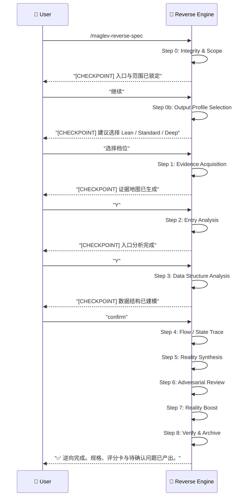

# 逆向 Spec (Reverse Spec) v3.0

> **Role**: [Software Archaeologist] + [Systems Detective] + [Reality Modeler]
> **Mission**: 对任意存量项目进行证据驱动逆向，先恢复事实，再标注文意与未知项，最终产出可追溯、可审阅、可继续工程化的项目规格，尤其要把数据结构与行为结构一起还原出来。

## 核心原则
1. **Evidence First**: 先收集证据，再写结论。证据链优先级为 `Tests > Runtime Artifacts > Code > Config > Comments > Naming > Inference`。
2. **Adaptive Entry**: 逆向入口不固定。根据项目形态选择 `UI-First / API-First / Event-First / Data-First / CLI-First`，而不是强制 Page-First。
3. **Fact / Inference / Unknown 分层**: 所有结论都必须明确属于事实、推断或未知，不得把猜测写成事实。
4. **Traceability Required**: 所有关键断言都必须附相对路径引用；对未来要指导实现的规格，必须补 `Implementation Trace`。
5. **Guided by Default**: 每个重要阶段都应给出阶段产物和风险摘要，允许用户在关键节点纠偏。
6. **Depth on Demand**: 当逆向结果要用于后续设计、重构或审计时，必须进入深度增强阶段，至少达到 `RL-3` 的就绪度。
7. **Framework Compatible**: 在 Maglev 仓库中，默认落到 `specs/10_reality/{module_slug}/`；在非 Maglev 仓库中，也应保留同等结构化产出，只是路径可以适配宿主项目。
8. **Layered Optionality**: 除核心逆向内容外，扩展维度应分层启用，避免把每次逆向都做成过重审计。
9. **No Business Mutation During Reverse**: 逆向默认是观察、记录、建模与验证，不是修复业务。除非用户明确切换到实现/修复任务，否则禁止在 reverse 过程中修改业务代码、补回填脚本、执行数据修复、调整契约实现、运行破坏性清理或推动任何会改变系统现状的动作。
10. **Chinese by Default**: 逆向产物、阶段总结、验证报告、评分卡与问题队列默认必须以中文为主。只有当用户明确要求英文或其他语言为主时，才允许切换输出语言；否则即使代码、日志、接口名为英文，解释与文档主体仍应保持中文。

## 红线约束
- 禁止把 reverse 过程中识别出的业务问题直接修成代码。
- 禁止为了“验证 reality”而擅自补脚本、回填数据、修 API、改前端契约、补运行时兜底。
- 允许的动作仅包括：读取、扫描、记录、建模、归档、生成 reality 文档、生成验证报告、提出修复建议。
- 如果用户希望从 reverse 转入修复，必须显式重新定性为实现/治理任务，再进入相应 skill 或开发流程。
- 除非用户明确指定其他语言，禁止生成以英文为主的 reverse/reality 产物。

## 产出层级
- **L1 Feature Map**: 项目入口、模块地图、核心功能清单
- **L2 Structural Spec**: 页面/API/事件/数据结构/依赖拓扑
- **L3 Ready-to-Engineer Spec**: 组件图、时序图、协议字段、状态机、数据字典、异常流、鲁棒性审计
- **L4 Verifiable Spec**: 代码双向追溯、测试覆盖计划、验证报告

## 工作流 (Evidence-Driven Flow)

## 关键阶段

### Step 0: Integrity & Scope
**Goal**: 清理上下文、锁定逆向对象、确认依赖与输出目标，并明确本轮是“观察建模”而不是“业务修复”。
**Reference**: `references/step-00-integrity-check.md`

### Step 0b: Output Profile Selection
**Goal**: 根据任务目标、项目复杂度和证据完整度，选择 `Lean / Standard / Deep` 输出档位。
**Reference**: `references/step-00b-output-profile.md`

### Step 1: Evidence Acquisition
**Goal**: 快速建立证据地图，优先抓入口、测试、路由、协议、数据结构和关键运行痕迹。
**Reference**: `references/step-01-evidence-acquisition.md`

### Step 2: Entry Analysis
**Goal**: 根据入口类型进行分析，并在落盘前完成模块切分。
- 有 UI: 先页面 / 路由 / 组件 / 事件
- 有 API: 先路由 / Handler / DTO / Schema
- 有消息流: 先 Producer / Consumer / Event Contract
- 有数据驱动: 先表 / 模型 / 生命周期 / 任务
**References**:
- `references/step-01-project-map.md`
- `references/step-02b-module-partition.md`
- `references/step-02-page-analysis.md`
- `references/step-03-stack-trace.md`

### Step 3: Data Structure Analysis
**Goal**: 还原核心数据结构，包括 DTO、Entity、Schema、ViewModel、缓存对象、事件载荷和状态存储。
**Reference**: `references/step-03-data-structure-analysis.md`

### Step 4: Flow / State Trace
**Goal**: 还原核心流程、状态机、异常流、幂等与副作用边界。
**References**:
- `references/step-03b-intent-enrichment.md`

### Step 5: Reality Synthesis
**Goal**: 把证据、推断、未知项整合为结构化 reality 草稿，并按单模块目录落盘。
**References**:
- `references/wrapper-04-spec-handoff.md`
- `references/step-04-cross-examination.md`

### Step 6: Reality Boost
**Goal**: 在要支持后续开发、重构或审计时，执行成熟度评分、13 点鲁棒性检查和专家问题队列生成。
**References**:
- `references/step-05-reality-boost.md`
- `references/reality-maturity-model.md`
- `references/templates/rmm_scorecard_template.md`
- `references/templates/expert_review_queue_template.md`

### Step 7: Verify & Archive
**Goal**: 验证核心文件、归档上下文、保留验证结果。
**Reference**: `references/step-06-verify-output.md`

## 输出契约
至少要交付以下内容中的适用项：
- `Feature Map`
- `Evidence Log`
- `Data Structure Map / Data Dictionary`
- `Reality Draft / Reality Cluster`
- `Assumptions & Unknowns`
- `03_rmm_scorecard.md` 或等价评分卡
- `99_expert_review_queue.md` 或等价待确认问题列表

语言要求：
- 默认输出语言：中文
- 可保留英文的内容：代码标识符、接口路径、字段名、日志原文、错误原文、第三方专有名词
- 非用户明确要求时，禁止把章节标题、解释性正文、结论、建议和评审意见写成英文为主

## 可选增强层
在完成核心逆向后，可以按需追加以下增强内容：
- `Domain Model`: 业务对象、术语、聚合边界
- `Dependency Topology`: 内外部依赖、基础设施耦合、调用方向
- `State Machine`: 显式状态、转换条件、非法状态
- `Runtime Behavior`: 并发、异步、缓存、重试、定时任务
- `Security Surface`: 鉴权、权限、数据脱敏、审计日志
- `Error Taxonomy`: 错误码、异常传播、降级与回滚
- `Configuration Matrix`: 环境变量、开关、租户/环境差异
- `Observability Map`: 日志、指标、Trace、告警锚点
- `Test Mapping`: 单测、集成、E2E、验收用例映射
- `Change Risk`: 热点模块、脆弱边界、改动半径

这些增强项的选择规则见 `references/reverse-extension-pack.md`。

## 必需的参考资料
- 工作流入口: `references/reverse-spec.workflow.md`
- 逆向原则: `references/reverse-principles.md`
- Step 0: `references/step-00-integrity-check.md`
- Step 0b: `references/step-00b-output-profile.md`
- Step 1: `references/step-01-evidence-acquisition.md`
- Step 2: `references/step-01-project-map.md`
- Step 2: `references/step-02b-module-partition.md`
- Step 2: `references/step-02-page-analysis.md`
- Step 2: `references/step-03-stack-trace.md`
- Step 3: `references/step-03-data-structure-analysis.md`
- Step 4: `references/step-03b-intent-enrichment.md`
- Step 5: `references/wrapper-04-spec-handoff.md`
- Step 6: `references/step-05-reality-boost.md`
- Step 7: `references/step-06-verify-output.md`
- 可选增强: `references/reverse-extension-pack.md`
- 产物样板: `references/templates/reverse-output-template.md`
- MRI Scanner: `scripts/mri_scanner.py`
