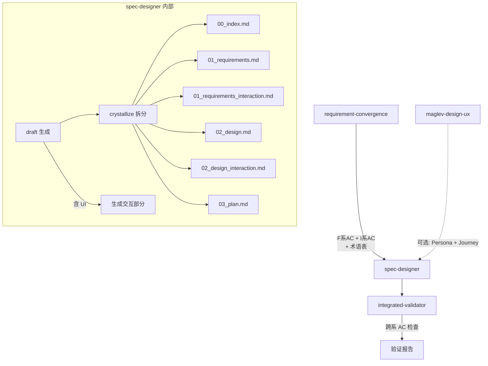

# Spec 文档体系设计 — 设计文档

## Overview

本方案为 Maglev 的 spec-designer 增加交互文档生成能力，并建立术语表和文档互联互验机制。改动集中在 spec-designer 的模板/流程文件和 integrated-validator 的检查逻辑。

前置依赖：`main_flow_quality_gates` 已实施的结构化 AC 格式（F-2）、AC 追溯链（F-3）和验证层前端能力（F-7）。

## 需求覆盖

| 需求 | AC | 设计覆盖位置 |
|------|-----|-------------|
| F-1 交互文档结构 | AC-F1-1 ~ F1-4 | §变更方案 F-1 |
| F-2 术语表机制 | AC-F2-1 ~ F2-4 | §变更方案 F-2 |
| F-3 文档互联互验 | AC-F3-1 ~ F3-4 | §变更方案 F-3 |

## 架构

### 文档生成流程（含交互文档）



虚线为可选路径。01_requirements_interaction.md 和 02_design_interaction.md 仅当项目含 UI 时生成。

## 组件职责

| 组件 | 现有职责 | 新增/修改职责 | 覆盖 AC |
|------|---------|-------------|---------|
| spec-designer/references/interaction-requirement-template.md | 不存在（新建） | 交互需求文档模板（I 系编号、4 维度覆盖） | AC-F1-1 ~ F1-4 |
| spec-designer/references/interaction-design-template.md | 不存在（新建） | 交互设计文档模板（stateDiagram、组件 API、响应式、可访问性） | AC-F1-1 |
| spec-designer/references/tech-spec-template.md | 统一规范草稿模板 | + 交互需求/设计区段（含 UI 时）+ 术语表小节 + 文档关系头部 | AC-F1-1, F2-1, F3-1 |
| _internal/spec-pipeline/crystallize/step-01-split-files.md | 拆分 4 文件 | + 支持拆分交互文档（最多 6 文件） | AC-F1-1 |
| requirement-convergence/references/step-02-define-requirements.md | 生成 F 系 AC | + 术语表生成指令 | AC-F2-1 |
| specs/10_reality/glossary.md | 不存在（新建） | 项目级术语文件 | AC-F2-2 |
| integrated-validator/references/step-02-cross-reference.md | 4 层 + AC 一致性 | + 跨系 AC 覆盖检查（F+I 系均被设计覆盖）+ 文档关系一致性 | AC-F3-2, F3-4 |

---

## 变更方案

### F-1: 交互需求文档结构

**改动 1: 新建 interaction-requirement-template.md**

在 `spec-designer/references/` 下新建交互需求模板文件，内容来自 `context/requirement_interaction_template_preview.md` 的模板部分（去除示例和设计原则说明）：

```markdown
# 交互需求文档模板

## 必须结构

1. **文档关系**：声明依赖的功能需求文档和下游交互设计文档
2. **简介**：从用户交互视角描述核心体验目标
3. **术语表**：定义该功能涉及的 UI/UX 关键术语
4. **交互需求列表**：I-{N} 编号，每条含交互场景 + AC-I{N}-{M}

## AC 维度要求

每条交互需求 AC 应覆盖以下至少一个维度：
- UI 状态（加载/空/错误/成功/骨架屏）
- 操作响应（点击/输入/手势/键盘）
- 视觉约束（响应式断点/布局切换/动效）
- 可访问性（键盘导航/屏幕阅读器/对比度）

## 跨系引用

交互 AC 可引用功能 AC 作为前置条件：
"当 AC-F1-1 的登录成功后，界面应…"
```

**改动 2: 新建 interaction-design-template.md**

在 `spec-designer/references/` 下新建交互设计模板文件，内容来自 `context/design_interaction_template_preview.md` 的模板部分：

```markdown
# 交互设计文档模板

## 必须小节

1. **文档关系**：声明依赖的交互需求、功能需求和技术设计文档
2. **Overview**：核心交互体验目标
3. **需求覆盖表**：I 系 AC → 设计位置映射
4. **UI 状态**：Mermaid stateDiagram-v2，每个核心场景一张
5. **组件清单**：含「覆盖 AC」列

## 推荐小节（按项目类型适配）

- 组件 API（Props/Events/Slots）— 有跨团队协作时必须
- 响应式策略 — 有多端适配需求时必须
- 动效规格
- Design Token 引用
- 可访问性方案 — 有 a11y AC 时必须
- 设计决策
```

**改动 3: 扩展 tech-spec-template.md**

在现有统一草稿模板中增加交互相关区段（当项目含 UI 时生成）：

```markdown
## 01b. 交互需求契约 (-> 01_requirements_interaction.md)（含 UI 项目时）

> 参照 interaction-requirement-template.md 格式

### 文档关系
...

### 交互需求
...

## 02b. 交互设计 (-> 02_design_interaction.md)（含 UI 项目时）

> 参照 interaction-design-template.md 格式

### UI 状态
...

### 组件清单
...
```

**改动 4: 扩展 crystallize/step-01-split-files.md**

在已支持文件列表中新增：

```markdown
**支持的文件列表 (Expected)**:
*   `00_index.md`
*   `01_requirements.md`
*   `01_requirements_interaction.md`（含 UI 项目时）
*   `02_design.md`
*   `02_design_interaction.md`（含 UI 项目时）
*   `03_plan.md`
*   *(以及任何 AI 动态生成的附加文件)*
```

---

### F-2: 术语表机制

**改动 1: step-02-define-requirements.md 增加术语表指令**

在结构化 AC 生成指令之后，增加：

```markdown
## 术语表生成

当生成结构化需求文档时，在 AC 列表之后生成术语表：

1. 扫描当前功能描述和 AC 中出现的专有名词、缩写、易混淆术语
2. 为每个术语提供一句话定义
3. 如果 specs/10_reality/glossary.md 存在，检查是否有已定义的术语可复用
4. 新术语追加到项目级术语文件的待确认区

格式：
- **{术语}**: {定义}
```

**改动 2: 新建 specs/10_reality/glossary.md**

```markdown
# 项目术语表

> 跨功能的项目级术语定义。由各 spec 的术语表汇总而来。
> 新会话启动时应被 reality-sync 加载。

## 已确认术语

| 术语 | 定义 | 来源 spec |
|------|------|----------|
| {术语} | {定义} | {spec slug} |

## 待确认术语

> 以下术语由 AI 自动提取，等待用户确认后移入"已确认"区。

| 术语 | 定义 | 来源 spec |
|------|------|----------|
```

**改动 3: reality-sync 加载提示**

在 reality-sync 的上下文加载步骤中，增加对 `glossary.md` 的检查：

```markdown
如果 specs/10_reality/glossary.md 存在且非空：
- 加载已确认术语到会话上下文
- 后续 requirement-convergence 可引用这些术语
```

---

### F-3: 文档互联互验机制

**改动 1: 文档关系头部**

在 tech-spec-template.md 的每个文件区段开头增加「文档关系」声明：

```markdown
## 文档关系

- **上游**: {依赖的文档列表}
- **下游**: {消费本文档的文档列表}
- **平行**: {同级别的关联文档}
```

具体关系：

| 文档 | 上游 | 下游 | 平行 |
|------|------|------|------|
| 01_requirements.md | PRD/用户输入 | 02_design.md, 03_plan.md | 01_requirements_interaction.md |
| 01_requirements_interaction.md | 01_requirements.md | 02_design_interaction.md, 03_plan.md | — |
| 02_design.md | 01_requirements.md | 03_plan.md, 代码 | 02_design_interaction.md |
| 02_design_interaction.md | 01_requirements_interaction.md, 02_design.md | 03_plan.md, 前端代码 | — |
| 03_plan.md | 02_design.md, 02_design_interaction.md | context-implementer | — |

**改动 2: integrated-validator 跨系 AC 检查**

在 step-02-cross-reference.md 的 Layer 2c（AC 引用一致性检查）中增加：

```markdown
## 跨系 AC 覆盖检查（当同时存在 F 系和 I 系 AC 时）

- 检查 02_design.md 的需求覆盖表是否覆盖了所有 F 系 AC
- 检查 02_design_interaction.md 的需求覆盖表是否覆盖了所有 I 系 AC
- 检查 03_plan.md 的任务列表是否同时引用了 F 系和 I 系 AC
- I 系 AC 完全缺失于 plan 时标记为 WARNING
```

**改动 3: 变更同步提醒**

在 integrated-validator 检查中增加文档同步提示：

```markdown
## 文档变更同步提醒

当检测到以下情况时，输出提醒：
- 01_requirements.md 修改日期 > 01_requirements_interaction.md → 提醒检查交互需求是否需要同步
- 02_design.md 修改日期 > 02_design_interaction.md → 提醒检查交互设计是否需要同步
- F 系 AC 数量变化但 I 系 AC 未变 → 提醒是否有新增功能需要交互覆盖

提醒级别为 INFO（非 WARNING），不阻塞流程。
```

---

## 变更影响范围

| 文件 | 改动类型 | 涉及 AC | 优先级 |
|------|---------|---------|:------:|
| `spec-designer/references/interaction-requirement-template.md` | 新建 | F1-1 ~ F1-4 | P0 |
| `spec-designer/references/interaction-design-template.md` | 新建 | F1-1 | P0 |
| `spec-designer/references/tech-spec-template.md` | 新增交互区段 + 术语表 + 文档关系 | F1-1, F2-1, F3-1 | P0 |
| `_internal/spec-pipeline/crystallize/step-01-split-files.md` | 扩展文件列表 | F1-1 | P0 |
| `requirement-convergence/references/step-02-define-requirements.md` | 新增术语表指令 | F2-1 | P1 |
| `specs/10_reality/glossary.md` | 新建 | F2-2 | P1 |
| `reality-sync` 上下文加载步骤 | 新增 glossary 检查 | F2-2 | P1 |
| `integrated-validator/references/step-02-cross-reference.md` | 新增跨系检查 + 同步提醒 | F3-2, F3-4 | P1 |

共 8 个文件受影响。4 个为 P0，4 个为 P1。

## 设计决策

| # | 决策 | 理由 | 备选方案 | 关联 AC |
|---|------|------|----------|---------|
| D-1 | 交互模板作为 spec-designer 的 references 文件，由 draft 流程按需加载 | 与现有模板加载机制一致 | 作为 _internal 共享模块 | F1-1 |
| D-2 | 术语表为需求文档内嵌小节 + 项目级汇总文件 | 内嵌保证就近可用，汇总保证跨 spec 一致 | 仅项目级 / 仅文档内嵌 | F2-1, F2-2 |
| D-3 | 文档变更同步为 INFO 级提醒，不阻塞 | 避免过度约束，同步决策权留给人 | 强制同步检查（WARNING） | F3-4 |
| D-4 | crystallize 拆分最多支持 6 文件（4 核心 + 2 交互） | 保持文件数可控，避免碎片化 | 不限制文件数 | F1-1 |
| D-5 | 简单交互（如一个弹窗）可内嵌功能需求，不强制拆分 | 避免过度文档化，与 NFR-1 向后兼容一致 | 所有 UI 都必须拆分 | F1-1 |
