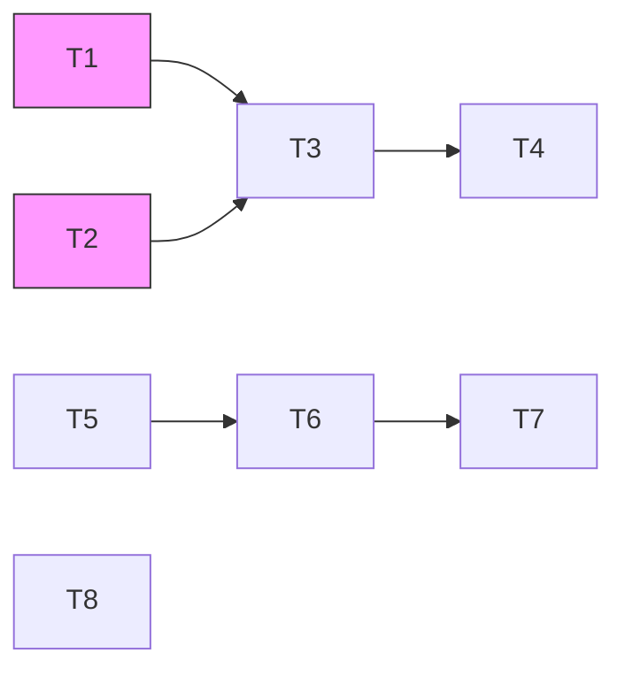

# Spec 文档体系设计 — 实施计划

## 任务总览

8 个任务，按优先级分 P0（4）和 P1（4）。

### P0 — 交互文档核心能力

| # | 任务 | 目标文件 | AC |
|---|------|---------|-----|
| T1 | 新建交互需求模板 | `spec-designer/references/interaction-requirement-template.md` | F1-1 ~ F1-4 |
| T2 | 新建交互设计模板 | `spec-designer/references/interaction-design-template.md` | F1-1 |
| T3 | 扩展统一草稿模板 | `spec-designer/references/tech-spec-template.md` | F1-1, F2-1, F3-1 |
| T4 | 扩展 crystallize 拆分 | `_internal/spec-pipeline/crystallize/step-01-split-files.md` | F1-1 |

### P1 — 术语表与互联互验

| # | 任务 | 目标文件 | AC |
|---|------|---------|-----|
| T5 | 术语表生成指令 | `requirement-convergence/references/step-02-define-requirements.md` | F2-1 |
| T6 | 项目级术语文件 | `specs/10_reality/glossary.md` | F2-2 |
| T7 | reality-sync 加载术语 | reality-sync 上下文步骤 | F2-2 |
| T8 | 跨系 AC 检查 + 同步提醒 | `integrated-validator/references/step-02-cross-reference.md` | F3-2, F3-4 |

## 依赖图

- T1、T2 可并行
- T5、T8 可并行（互不依赖）
- P0 和 P1 之间无依赖，可并行推进

## AC 覆盖追溯

| AC | 需求位置 | 设计位置 | 实施任务 |
|----|---------|---------|---------|
| AC-F1-1 | F-1 | F-1 改动 1~4 | T1, T2, T3, T4 |
| AC-F1-2 | F-1 | F-1 改动 1 | T1 |
| AC-F1-3 | F-1 | F-1 改动 1 | T1 |
| AC-F1-4 | F-1 | F-1 改动 1 | T1 |
| AC-F2-1 | F-2 | F-2 改动 1 | T5 |
| AC-F2-2 | F-2 | F-2 改动 2~3 | T6, T7 |
| AC-F2-3 | F-2 | F-2 改动 1 | T5 |
| AC-F2-4 | F-2 | F-2 改动 2 | T6 |
| AC-F3-1 | F-3 | F-3 改动 1 | T3 |
| AC-F3-2 | F-3 | F-3 改动 2 | T8 |
| AC-F3-3 | F-3 | F-3 改动 1 | T3 |
| AC-F3-4 | F-3 | F-3 改动 3 | T8 |

12/12 AC 全覆盖。

## 风险与缓解

| 风险 | 影响 | 缓解 |
|------|------|------|
| tech-spec-template 再次修改可能与 quality_gates 冲突 | P0 | 增量追加，不改动已有结构 |
| integrated-validator 已有 3 层检查，再加跨系检查增加复杂度 | P1 | 作为 Layer 2c 的子项嵌入，不新增层 |
| 术语表手动维护成本 | P1 | 自动提取 + 待确认区，降低人工负担 |

## 验收标准

- [x] 8/8 任务完成
- [x] 12/12 AC 有对应实现
- [x] 含 UI 的 spec 能生成 6 文件（含交互文档）
- [x] 不含 UI 的 spec 行为不变（向后兼容）
