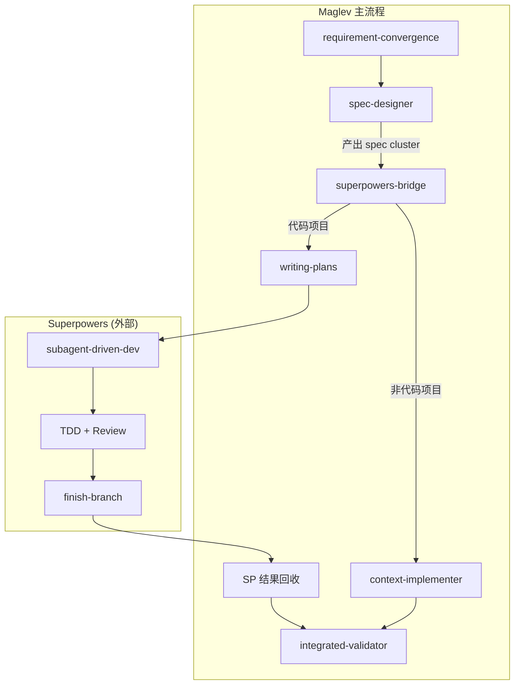
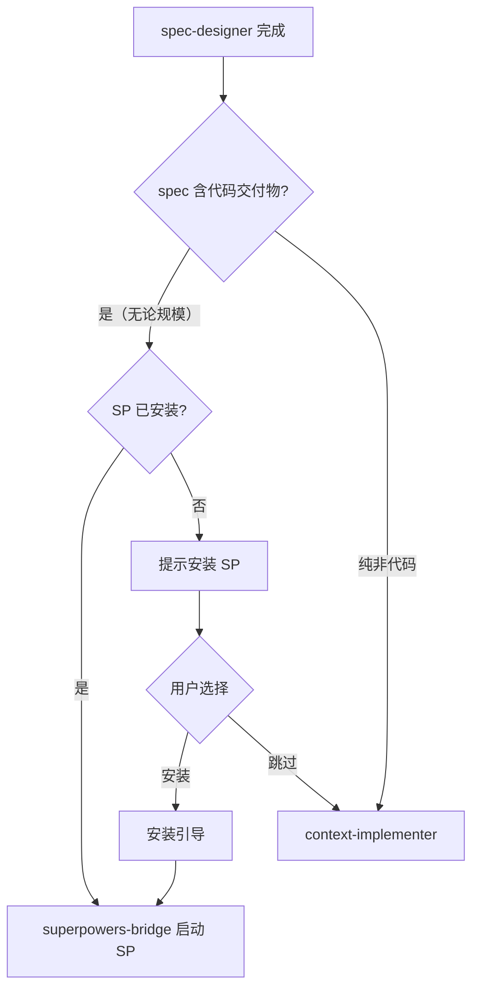
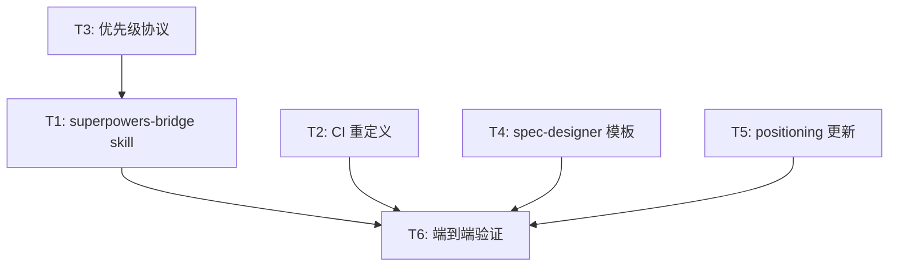

# 统一规范草稿: Maglev × Superpowers 深度整合

> **指南**: 定稿后，此文件将被拆分为 `00_index.md`, `01_requirements.md`, `02_design.md` 和 `03_plan.md`。

## 00. 索引与元数据 (-> 00_index.md)
*   **负责人**: Maglev contributors
*   **状态**: 规划中 (Planning)
*   **最后更新**: 2026-05-31

## 00b. 文档关系声明

| 文档 | 上游 | 下游 | 平行 |
|------|------|------|------|
| 01_requirements.md | positioning.md, 本次需求对话 | 02_design.md, 03_plan.md | — |
| 02_design.md | 01_requirements.md | 03_plan.md, AGENTS.md 变更 | — |
| 03_plan.md | 02_design.md | context-implementer 重构, 新 skill 创建 | — |

---

## 01. 需求契约 (-> 01_requirements.md)

### 1.1 核心意图 (Intent)

Maglev 在"从 Spec 到可验证代码"的执行阶段缺乏结构化纪律（无强制 TDD、无 subagent 分派、无两阶段 review）。通过与 Superpowers (obra/superpowers) 深度整合，让 Maglev 在代码项目的实施阶段将控制权委托给 Superpowers，获得：
- 严格的 TDD 纪律（铁律级红绿重构）
- 基于 subagent 的任务分派与隔离执行
- 两阶段代码审查（spec 合规 + 代码质量）
- Git worktree 工作区隔离
- 自主执行能力（数小时无需人工介入）

### 1.2 功能需求 (Functional Requirements)

#### F-1: Spec → SP 执行启动

**用户故事**: 作为 Maglev 用户，我希望 spec-designer 产出的 Spec 能无缝启动 Superpowers 的执行流程，以便直接进入代码实施阶段。

**验收标准**:
- AC-F1-1: 当决定使用 SP 执行时，系统应向 SP 的 writing-plans 提供 Maglev spec 的 `02_design.md` 作为设计输入，让 SP 自行生成细粒度计划
- AC-F1-2: 启动 SP 时，系统应传递项目上下文（tech stack、文件结构、测试基础设施状态），而非仅传 spec 文本
- AC-F1-3: SP 的 brainstorming 阶段必须被跳过（Maglev 已完成需求收敛和方案设计）

**边界情况**:
- Spec 不含代码类交付物时，不启动 SP
- 若 Maglev spec 的 `03_plan.md` 已含细粒度任务+代码块，可直接作为 SP plan 使用（跳过 writing-plans）

#### F-2: 实施路由决策

**用户故事**: 作为 Maglev 用户，我希望系统在进入实施阶段时自动判断是委托 Superpowers 还是由 context-implementer 处理，以便每个项目用最合适的执行路径。

**验收标准**:
- AC-F2-1: 当 spec 的交付物包含代码（无论规模大小）时，系统应路由至 Superpowers。没有复杂度阈值——SP 内部自行决定用 TDD 直接做还是走 subagent-driven-development
- AC-F2-2: 当 spec 的交付物仅涉及文档、配置、分析或 Maglev 自身 skill 维护时，系统应路由至 context-implementer
- AC-F2-3: 若 Superpowers 未安装（skill 文件不存在），系统应回退至 context-implementer 并向用户说明原因
- AC-F2-4: 当 spec 同时包含代码和非代码交付物时，代码部分走 SP，非代码部分由 context-implementer 处理（可串行，先 SP 后 CI）

**边界情况**:
- 用户可手动覆盖路由决策（"直接用 SP" / "不用 SP 自己做"）
- "Maglev 自身 skill 维护"（改 SKILL.md、AGENTS.md）归 context-implementer 即使涉及少量代码片段

#### F-3: SP 执行结果回收

**用户故事**: 作为 Maglev 用户，我希望 Superpowers 完成代码执行后，结果能自动回流到 Maglev 的验证体系，以便 integrated-validator 对交付物做四层交叉验证。

**验收标准**:
- AC-F3-1: 当 SP 完成所有 task 并通过 finishing-a-development-branch 时，系统应触发 Maglev 的 integrated-validator
- AC-F3-2: 若 SP 执行中遇到 BLOCKED 状态无法自行解决，系统应将问题上报至用户（不自行降级处理）
- AC-F3-3: 当 SP 完成时，代码变更的 git 提交记录应可被 Maglev 的 review-validation-surface 消费

**边界情况**:
- SP 选择 merge 而非 PR 时，validator 仍能工作

#### F-4: Superpowers 安装与检测

**用户故事**: 作为 Maglev 用户，我希望系统能检测 Superpowers 是否已安装，并在需要时指导我完成安装。

**验收标准**:
- AC-F4-1: 当 agent 环境中存在 Superpowers skill 文件时，系统应识别为"已安装"
- AC-F4-2: 当 agent 环境中不存在 SP skill 时，系统应提供安装指引（按当前 agent 平台对应的方式）
- AC-F4-3: 若用户选择不安装 SP，系统应正常回退到 context-implementer 全流程

### 1.3 非功能需求 (Non-Functional Requirements)

- **NFR-1 兼容性**: 整合方案必须兼容 Claude Code 和 GitHub Copilot CLI 两个主要 agent 平台
- **NFR-2 非侵入**: 不 fork/修改 Superpowers 源码，仅通过协议层对接
- **NFR-3 可退出**: 用户任何时候可以选择不使用 SP，回退到纯 Maglev 流程
- **NFR-4 透明度**: 路由决策和委托过程对用户透明可见

### 1.4 术语表

- **SP**: Superpowers (obra/superpowers)，面向 AI coding agent 的软件开发方法论
- **启动指令**: 一段标准化 prompt，告诉 agent "读取 SP 的 skill 文件并按其流程执行"，将 Maglev spec 路径注入
- **路由决策**: 在实施阶段判断使用 SP 还是 context-implementer 的决策点
- **两阶段 Review**: SP 的任务级审查——先检查 spec 合规性，再检查代码质量
- **四层交叉验证**: Maglev 的 integrated-validator 验证 requirements↔spec↔code↔tests 一致性
- **Subagent**: SP 中用于任务执行的隔离子代理，每个 task 一个新 subagent
- **注意力切换**: "委托" 的真实技术机制——agent 从 Maglev skill 切换到 SP skill 作为行为指导

### 1.5 粗略边界 (Rough Boundaries)

**做**:
- 启动指令模板（传递 spec + 项目上下文给 SP）
- 实施路由逻辑（代码=SP，非代码=CI）
- context-implementer 职能重定义（退出代码执行）
- SP 安装检测与引导
- 结果回收到 Maglev 验证层
- Skill 优先级协议（Maglev entry-router 始终为最高层入口）

**不做**:
- 修改 Superpowers 本身的 skill 文件
- 替代 SP 的 TDD/plan/review 能力（那是 SP 的事）
- 构建新的代码执行引擎

---

## 02. 技术蓝图 (-> 02_design.md)

### 2.0 Overview

通过一个新 skill (`superpowers-bridge`) 和 `context-implementer` 的职能重定义，实现 Maglev 与 Superpowers 的委托式整合。

**"委托"的真实技术机制**：不是 RPC 或 API 调用。SP 是一组 `.md` skill 文件，"委托" 意味着 agent 在执行阶段切换行为指导源——从读取 Maglev 的 skill 切换到读取 SP 的 skill，并在后续 turn 中遵循 SP 的流程。`superpowers-bridge` 负责三件事：检测 SP 可用性、构造启动指令（注入 spec 上下文）、在 SP 完成后回收结果交给 Maglev validator。

**Skill 优先级协议**：Maglev 的 `entry-router` 始终是最高层入口。SP 的 skill 在被 bridge 显式激活后才生效，不与 Maglev 主流程 skill 竞争自动触发。SP 的 `brainstorming` 和 `using-superpowers` 不参与 Maglev 语境下的自动触发。

**SP Review vs Maglev Validator 的分工**：
- SP 两阶段 Review = **任务级**质量门禁（每个 task 完成后，检查代码是否符合 plan、代码本身质量如何）
- Maglev integrated-validator = **项目级**一致性验证（所有代码完成后，交叉验证 requirements↔spec↔code↔tests 四层对齐）
- 两者互补不冗余：SP 保证每块砖合格，Maglev 保证整栋楼合图纸

### 2.1 需求覆盖表

| 需求 | AC | 设计覆盖位置 |
|------|-----|-------------|
| F-1 | AC-F1-1 ~ F1-3 | §superpowers-bridge skill, §format-converter |
| F-2 | AC-F2-1 ~ F2-4 | §routing-logic, §context-implementer 重定义 |
| F-3 | AC-F3-1 ~ F3-3 | §result-collector, §validator-hookup |
| F-4 | AC-F4-1 ~ F4-3 | §detection-module |

### 2.2 架构视图



### 2.3 组件职责表

| 组件 | 现有职责 | 新增/修改职责 | 覆盖 AC |
|------|---------|-------------|---------|
| `superpowers-bridge` (新) | — | 格式转换、路由决策、SP 检测、结果回收 | AC-F1-*, AC-F2-*, AC-F3-*, AC-F4-* |
| `context-implementer` | 轻量编码兜底 | **退出代码执行职责**，专注非代码实施 | AC-F2-2 |
| `spec-designer` | 方案设计 | 03_plan.md 增加 `delivery_type` 元数据 | AC-F1-1 |
| `integrated-validator` | 综合验证 | 接收 SP 执行结果作为验证输入 | AC-F3-1 |
| `entry-router` | 入口分流 | 感知 SP 可用性，影响路由建议 | AC-F4-1 |

### 2.4 变更方案

#### F-1: Spec → SP 执行启动

**设计决策**: 不做格式转换工具。SP 的 `writing-plans` 本身就能消费自然语言 spec。真正需要的是一段**启动指令**，将 Maglev 的设计文档路径 + 项目上下文注入 SP 流程。

**启动指令模板** (`superpowers-bridge` 构造并传递给 agent):

```
你即将进入 Superpowers 的代码执行流程。

== 行为指令 ==
1. 读取并遵循 superpowers:writing-plans skill
2. 跳过 superpowers:brainstorming（设计已由 Maglev 完成）
3. 以下面的设计文档为输入生成实施计划

== 设计输入 ==
- 设计文档: {spec_cluster_path}/02_design.md
- 需求文档: {spec_cluster_path}/01_requirements.md
- 项目技术栈: {tech_stack}
- 测试基础设施: {test_framework} (如 pytest/jest/go test)
- 已有测试: {existing_test_count} 个

== 约束 ==
- 遵循 TDD（superpowers:test-driven-development）
- 完成后使用 superpowers:finishing-a-development-branch
- 遇到 BLOCKED 时上报用户，不自行降级
```

**两种启动模式**:
- **Design-first** (默认): Maglev 的 `02_design.md` → SP writing-plans 生成细粒度 plan → 执行
- **Plan-ready** (加速): 若 Maglev `03_plan.md` 已含细粒度任务+代码块 → 直接作为 SP plan → 跳过 writing-plans → 进入 subagent-driven-development

#### F-2: 实施路由逻辑

**路由判断算法**:



**没有复杂度阈值。** 即使改 1 行代码也走 SP。SP 内部会自动匹配规模：
- 单任务 → 直接 TDD 循环（~5 分钟）
- 多任务 → subagent-driven-development（数小时自主执行）

**"代码交付物"判断依据**:
- spec frontmatter 的 `delivery_type: code | mixed`
- 或 `files_to_modify` / `02_design.md` 中涉及 `.py`, `.ts`, `.js`, `.go`, `.rs`, `.java` 等源码文件
- 或 spec 的 03_plan 中的任务描述含"实现"、"编写函数"、"创建模块"等关键词

**"非代码交付物"判断依据**:
- `delivery_type: docs | ops`
- 仅涉及 `.md`, `.yaml`, `.json`（配置类）
- Maglev 自身 skill/协议维护（即使含代码片段，如 SKILL.md 中的示例代码）

**手动覆盖**: 用户在任何时候可以说 "这个不用 SP" 或 "这个用 SP"，覆盖自动判断。

#### F-3: SP 执行结果回收

**回收机制**:
1. SP 的 `finishing-a-development-branch` 完成后，产出：
   - Git 分支（含所有代码提交）
   - 可选的 PR
2. `superpowers-bridge` 收集：
   - 变更文件列表 (`git diff --stat`)
   - 测试通过状态
   - SP review 结果摘要
3. 传递给 `integrated-validator`：
   - 原始 spec cluster 路径
   - 代码变更 diff
   - 测试结果

#### F-4: SP 安装检测

**检测逻辑**:
```python
# 按 agent 平台分别检测
# Claude Code: 检查 /plugin list 输出含 superpowers
# Copilot CLI: 检查 skills/ 目录或 plugin 配置
# 通用: 检查当前工作目录是否有 superpowers skill 文件
```

因为 Superpowers 的安装方式因 agent 平台而异，桥接层采用**最宽松检测**：只要能找到 SP 的核心 skill 文件（`skills/writing-plans/SKILL.md` 或等效路径），即认为已安装。

### 2.5 设计决策表

| # | 决策 | 理由 | 备选方案 | 关联 AC |
|---|------|------|----------|---------|
| D-1 | 新建 `superpowers-bridge` skill 而非改造 CI | 职责分离、可独立禁用 | 直接在 CI 中加路由逻辑 | AC-F2-1 |
| D-2 | SP brainstorming 完全跳过 | 与 Maglev 的 requirement-convergence + spec-designer 重叠 | 让 SP 也做一次 brainstorming 确认 | AC-F1-3 |
| D-3 | context-implementer 彻底退出代码执行 | 避免逃生门导致 SP 成为空壳；SP 内部已有规模适配 | CI 保留轻量编码（≤3文件）——**否决：会导致 SP 永不被用** | AC-F2-1 |
| D-4 | 不 fork SP，通过启动指令模板对接 | 降低维护成本，SP 可独立升级 | 内嵌 SP 的 skill 文件到 Maglev | NFR-2 |
| D-5 | Maglev entry-router 为最高层入口 | 避免两套 skill 系统竞争触发 | 让 SP 的 using-superpowers 自动触发——**否决：会绕过 Maglev 上游** | 全局 |
| D-6 | SP 任务级 Review + Maglev 项目级 Validator = 互补不冗余 | SP 保证每块砖合格，Maglev 保证整栋楼合图纸 | 只用 SP review——**否决：丢失四层交叉验证** | AC-F3-1 |
| D-7 | 启动指令模板而非格式转换工具 | SP writing-plans 已能消费自然语言 spec，格式桥是过度工程 | 构建 AST 级格式转换器 | AC-F1-1 |

### 2.6 数据模型变更

**spec frontmatter 新增字段**:
```yaml
delivery_type: code  # code | docs | ops | mixed
sp_plan_path: ''     # 生成的 SP plan 文件路径（回填）
```

**superpowers-bridge 内部状态**:
```yaml
sp_installed: true/false
sp_platform: claude-code | copilot-cli | opencode | ...
spec_source: path/to/spec/cluster
plan_generated: path/to/sp/plan.md
execution_status: pending | running | completed | blocked
result_branch: feat/xxx
```

---

## 03. 实施计划 (-> 03_plan.md)

### 3.1 实施任务

- [ ] T1: 创建 `superpowers-bridge` skill → _需求: AC-F4-*, AC-F1-*, AC-F2-1_
  - 创建 `.agents/skills/superpowers-bridge/SKILL.md`
  - 定义：SP 检测逻辑、启动指令模板、路由判断标准、结果回收流程
  - 注册到 `.agents/private-catalog.yaml`

- [ ] T2: 重定义 context-implementer → _需求: AC-F2-2_
  - 更新 SKILL.md：明确退出代码执行职责
  - 新定位：非代码实施（文档、配置、分析、Maglev 自维护）
  - 保留自检和对抗性审查流程（适用于非代码产出）

- [ ] T3: 定义 Skill 优先级协议 → _需求: D-5_
  - AGENTS.md 补充：Maglev entry-router 始终最高层；SP skill 仅在 bridge 显式激活后生效
  - 禁止 SP brainstorming / using-superpowers 自动触发

- [ ] T4: 更新 spec-designer 模板 → _需求: AC-F1-1_
  - tech-spec-template.md frontmatter 增加 `delivery_type`
  - 让 spec 产出时自动判断并标注交付物类型

- [ ] T5: 更新 positioning.md → _需求: 全局_
  - SP 关系从"示例编码工具"升级为"深度整合执行伙伴"
  - 明确 Maglev 不做代码执行的定位更加坚定

- [ ] T6: 端到端验证 → _需求: AC-F3-*_
  - 选择一个真实小型代码需求走完全流程
  - 验证：spec → bridge → SP 执行 → integrated-validator

### 3.2 任务依赖



### 3.3 验证计划

1. **路由验证**: 模拟三种场景（纯代码 spec、纯文档 spec、混合 spec）确认路由正确
2. **启动验证**: 用 bridge 构造启动指令，确认 SP 的 writing-plans 能正确消费 Maglev spec
3. **端到端验证**: 选择一个小型代码需求，走完 Maglev spec → SP 执行 → validator 全流程
4. **回退验证**: 模拟 SP 未安装场景，确认 context-implementer 正常接管
5. **覆盖验证**: 用户手动覆盖路由，确认两个方向都能工作
