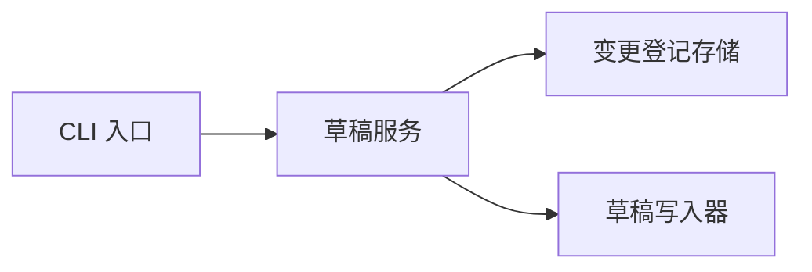

# 架构模板

## 读者问题

模块由哪些静态构件构成、边界在哪里、哪些关系可从静态材料确认、哪些架构结论仍未知？

## 静态来源角色

架构/技术设计说明意图与约束；代码、配置、构建描述和依赖声明证实构件与关系。图只能表达已经定位的
关系，不能补画运行时拓扑。

## 落地结构

### 1. 架构范围与约束

| 范围对象 | 模块内责任 | 已知约束 | 静态依据 |
| --- | --- | --- | --- |

### 2. 静态关系图

仅在构件及关系各有锚点时作 Mermaid 图；每条边均在下表有对应行。

### 3. 构件与边界表

| 构件 | 职责 | 入/出边界 | 关键锚点 | 关联页面 |
| --- | --- | --- | --- | --- |

### 4. 架构未知项与深挖

| 未知/限制 | 未能证明的原因 | 已查材料 | 深挖入口 |
| --- | --- | --- | --- |

## 完整正向示例

### 架构范围与约束

| 范围对象 | 模块内责任 | 已知约束 | 静态依据 |
| --- | --- | --- | --- |
| 发布说明生成器 | 读取登记变更并生成草稿 | 只处理本地登记存储 | `src/cli/generate.ts#run`；`config/defaults.yaml#release_notes` |

### 静态关系图

### 构件与边界表

| 构件 | 职责 | 入/出边界 | 关键锚点 | 关联页面 |
| --- | --- | --- | --- | --- |
| CLI 入口 | 解析生成请求 | 命令参数 → 服务调用 | `src/cli/generate.ts#run` | `interfaces/cli.md` |
| 草稿服务 | 组合变更内容 | 变更集合 → 草稿 | `src/service/draft.ts#create` | `implementation/components.md` |
| 变更登记存储 | 读取已选变更 | 本地记录读取 | `src/store/entries.ts#listSelected` | `implementation/data.md` |

### 架构未知项与深挖

| 未知/限制 | 未能证明的原因 | 已查材料 | 深挖入口 |
| --- | --- | --- | --- |
| 是否存在远程存储实现 | 当前范围仅发现本地 store | `src/store/` | `implementation/dependencies.md` |

## 模板审阅项

- 图中每一条关系是否能回到构件表和静态锚点？
- 构件表是否说明边界，而非仅罗列目录？
- 未知项是否避免把“未扫描到”写成“不存在”？
