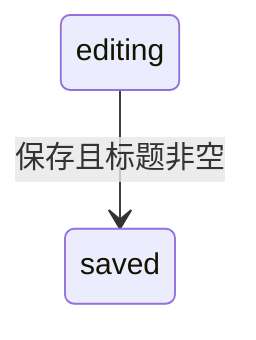

# 状态模型模板

## 读者问题

模块有哪些可定位状态、由什么触发转换、状态如何持久化、哪些终止或异常状态未被静态材料覆盖？

## 静态来源角色

枚举、Schema、状态机代码、转换处理器和测试建立状态事实；需求可说明期望状态但不证明转换已实现。

## 落地结构

### 1. 状态范围与存储

| 状态对象 | 状态定义位置 | 持久化/内存边界 | 业务含义依据 | 状态 |
| --- | --- | --- | --- | --- |

### 2. 状态与转换表

| 当前状态 | 触发 | 后继状态 | 守卫/拒绝条件 | 实现与测试锚点 |
| --- | --- | --- | --- | --- |

### 3. 状态图

仅为转换表中有静态证据的边绘图；终态和未知转换不可在图中假设。

### 4. 终止、未知与阻塞

| 项目 | 缺少依据 | 已查范围 | 深挖入口 |
| --- | --- | --- | --- |

## 完整正向示例

### 状态范围与存储

| 状态对象 | 状态定义位置 | 持久化/内存边界 | 业务含义依据 | 状态 |
| --- | --- | --- | --- | --- |
| 草稿 | `src/domain/draft.ts#DraftState` | `draft_entry.state` | `docs/prd/release-notes.md#草稿状态` | established |

### 状态与转换表

| 当前状态 | 触发 | 后继状态 | 守卫/拒绝条件 | 实现与测试锚点 |
| --- | --- | --- | --- | --- |
| `editing` | 保存 | `saved` | title 非空 | `src/service/draft.ts#save`；`tests/draft.test.ts#saves-title` |

### 状态图

### 终止、未知与阻塞

| 项目 | 缺少依据 | 已查范围 | 深挖入口 |
| --- | --- | --- | --- |
| saved 后是否可重新编辑 | 未定位状态转换 | 状态枚举与 save 处理器 | `capability/workflows.md` |

## 模板审阅项

- 状态、存储和业务含义是否分别有来源？
- 每条图边是否可回到转换表与实现锚点？
- unknown 是否明确是状态不存在、转换未定位还是范围未覆盖？
